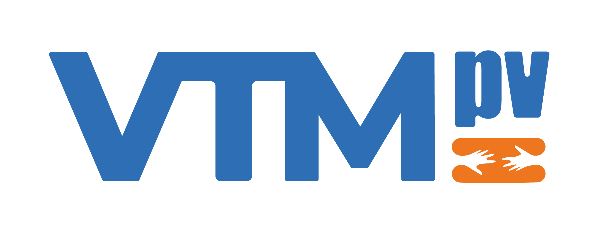

# Inteli - Instituto de Tecnologia e Liderança 

<p align="center">
<a href= "https://www.inteli.edu.br/"></a>
</p>
<br>

# Voluntariado Transformador Massivo - VTM

<div align="center">

</div>
<br>

## League of Volunteers - LoV

<div align="center">

</div>
<br>

## 🧑🏻‍🎓 Integrantes 
- <a href="https://www.linkedin.com/in/nicolas-silva-4a6aa02b4/">Nicolas Ramon</a>
- <a href="https://www.linkedin.com/in/matheusfgs/">Matheus Souza</a>
- <a href="https://www.linkedin.com/in/marcelo-rossignolli/">Marcelo Rossignolli</a> 
- <a href="https://www.linkedin.com/in/ian-pereira-simao/">Ian Pereira Simão</a> 
- <a href="https://www.linkedin.com/in/joão-gabriel-ouro-preto/">João Gabriel de Ouro Preto</a>
- <a href="https://www.linkedin.com/in/eduardo-f-libutti-salles-599299263/">Eduardo Faris Libutti Salles</a> 
- <a href="https://www.linkedin.com/in/vinicius-maciel-flor-8ab5b62b2/">Vinicius Maciel Flor</a>

## 🧑🏻‍🏫 Professores:
### Orientador(a) 
- <a href="https://www.linkedin.com/in/juliastateri/">Julia Stateri</a>
### Instrutores
- <a href="https://www.linkedin.com/in/cristiano-benites-687647a8/">Cristiano Benites</a>
- <a href="https://www.linkedin.com/in/egondaxbacher/∫">Egon Daxbacher</a> 
- <a href="https://www.linkedin.com/in/bruna-mayer-00a556174/">Bruna Mayer</a> 
- <a href="https://www.linkedin.com/in/filipe-gon%C3%A7alves-08a55015b/">Filipe Gonçalves</a>
- <a href="https://www.linkedin.com/in/ricardo-josé-missori/">Ricardo Missori</a>
- <a href="https://www.linkedin.com/in/tatiane-gandra/">Tatiane Granda</a>

## 📝 Descrição

O Voluntariado Transformador Massivo (VTM) é um projeto inovador desenvolvido pela League of Volunteers (LoV) em parceria com a Inteli - Instituto de Tecnologia e Liderança. Este projeto tem como objetivo principal criar uma plataforma digital que conecte voluntários a organizações não governamentais (ONGs) e empresas que necessitam de apoio em diversas causas sociais. A plataforma funciona como uma rede social, onde os voluntários podem se inscrever, compartilhar suas experiências e se engajar em ações voluntárias.

A VTM visa facilitar a interação entre voluntários e ONGs, tornando o processo de engajamento mais intuitivo e acessível. A plataforma permite que os voluntários criem perfis personalizados com "tags" que representam suas habilidades e áreas de interesse, como "programador", "médico", "causa feminina", entre outros. Isso ajuda as ONGs a encontrar voluntários que melhor se adequam às suas necessidades.

Além de conectar voluntários e ONGs, a plataforma permite que os voluntários promovam suas próprias ações sociais, convidando outros membros da comunidade a participar. Isso incentiva a colaboração e o engajamento em iniciativas que causam impacto positivo na sociedade.

## 📝 Link de demonstração

_Coloque aqui o link para seu projeto publicado e link para vídeo de demonstração_

## 📁 Estrutura de pastas

Dentre os arquivos e pastas presentes na raiz do projeto, definem-se:

- <b>document</b>: aqui estão todos os documentos do projeto, como o Web Application Document (WAD) bem como documentos complementares, na pasta "other".

- <b>src</b>: Todo o código fonte criado para o desenvolvimento do projeto de aplicação web.

- <b>README.md</b>: arquivo que serve como guia introdutório e explicação geral sobre o projeto e a aplicação (o mesmo arquivo que você está lendo agora).

## 💻 Configuração para Desenvolvimento e Execução do Código

Aqui encontram-se todas as instruções necessárias para a instalação de todos os programas, bibliotecas e ferramentas imprescindíveis para a configuração do ambiente de desenvolvimento.

1. **Baixar e instalar o Node.js**:
   - Acesse o site oficial do Node.js: [https://nodejs.org/](https://nodejs.org/)
   - Baixe a versão 16.15.1 LTS e siga as instruções de instalação.

2. **Clonar o repositório**:
   - Utilize o comando abaixo no terminal para clonar o repositório:
     ```sh
     git clone https://github.com/Inteli-College/2024-1B-T11-IN02-G04.git
     ```


3. **Instalar as dependências**:
   - No modo administrador, abra o "prompt de comando" ou o "terminal" e navegue até a pasta source:
     ```sh
     cd src
     ```
   - Instale as dependências do projeto usando o npm:
     ```sh
     npm install
     ```
   Isso instalará todas as dependências definidas no arquivo `package.json` que são necessárias para rodar o projeto.

4. **Configurar o banco de dados**:
   - Certifique-se de que o banco de dados está configurado corretamente conforme especificado na documentação do projeto.
   - Atualize as configurações de conexão do banco de dados no arquivo `config/datastores.js`.

5. **Iniciar a aplicação**:
   - Para iniciar a aplicação, utilize o comando:
     ```sh
     sails lift
     ```
   - Isso iniciará o servidor Sails.js.

6. **Acessar a aplicação**:
   - Agora você pode acessar a aplicação através do link: [http://localhost:1337](http://localhost:1337)
   - O servidor está online e pronto para uso.

Seguindo esses passos, você configurará corretamente o ambiente de desenvolvimento e execução do projeto utilizando Sails.js.


## 🗃 Histórico de lançamentos

# Histórico de Versões

- **0.5.1 - 22/06/2024**
    - Refinamento da plataforma e realização de testes de usabilidade com uma variedade de usuários

- **0.4.0 - 08/06/2024**
    - Implementação de testes automatizados, conclusão de grande parte do frontend e backend da aplicação

- **0.3.1 - 25/05/2024**
    - Melhorias nos protótipos e lançamento da segunda versão da aplicação web com funcionalidades de criação e exibição de ações sociais

- **0.2.0 - 12/05/2024**
    - Desenvolvimento de protótipos detalhados, modelagem do banco de dados e lançamento da primeira versão da aplicação web com funcionalidade de cadastro de usuários

- **0.1.0 - 27/04/2024**
    - Definição da Arquitetura de Software e criação dos Wireframes


## 📋 Licença/License

<p xmlns:cc="http://creativecommons.org/ns#" xmlns:dct="http://purl.org/dc/terms/"><a property="dct:title" rel="cc:attributionURL" href="https://github.com/Inteli-College/2024-1B-T11-IN02-G04">Voluntariado Transformador Massivo - VTM</a> by <a rel="cc:attributionURL dct:creator" property="cc:attributionName" href="https://www.inteli.edu.br/">Inteli</a>, <a href="https://github.com/NicolasRamonm">Nicolas Ramon</a>, <a href="https://github.com/matheusfrn">Matheus Souza</a>, <a href="https://github.com/Marchelo-Rossignolli">Marcelo Rossignolli</a>, <a href="https://github.com/ianpsa">Ian Pereira Simão</a>, <a href="https://github.com/joaoouro">João Gabriel de Ouro Preto</a>, <a href="https://github.com/EduLibutti">Eduardo Faris Libutti Salles</a>, <a href="https://github.com/viniciusmflor">Vinicius Maciel Flor</a> is licensed under <a href="http://creativecommons.org/licenses/by/4.0/?ref=chooser-v1" target="_blank" rel="license noopener noreferrer" style="display:inline-block;">Attribution 4.0 International</a>.</p>
