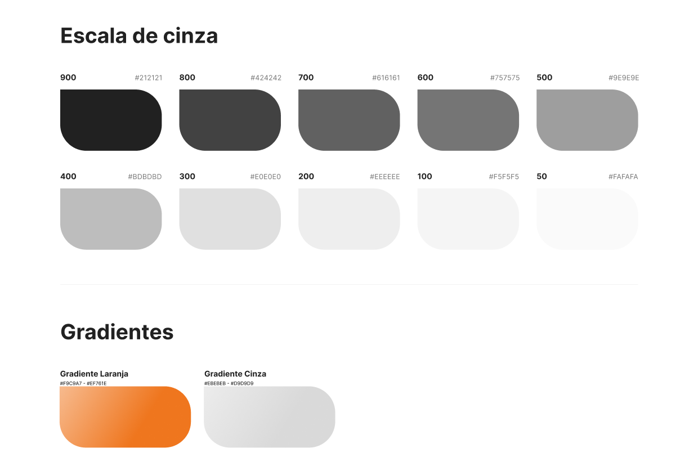
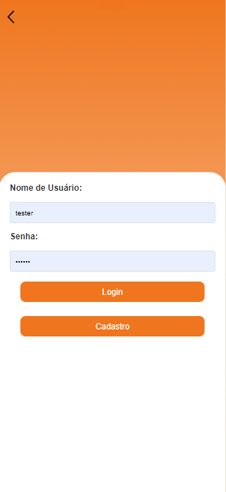

# WAD - Web Application Document - Módulo 2 - Inteli


### LoV - League of Volunteers


#### Nomes dos integrantes do grupo

- <a href="https://www.linkedin.com/in/nicolas-silva-4a6aa02b4/">Nicolas Ramon</a>
- <a href="https://www.linkedin.com/in/matheusfgs/">Matheus Sousa</a>
- <a href="https://www.linkedin.com/in/marcelo-rossignolli/">Marcelo Rossignolli</a> 
- <a href="https://www.linkedin.com/in/ian-pereira-simao/">Ian Pereira Simão</a> 
- <a href="https://www.linkedin.com/in/joão-gabriel-ouro-preto/">João Gabriel de Ouro Preto</a>
- <a href="https://www.linkedin.com/in/eduardo-f-libutti-salles-599299263/">Eduardo Faris Libutti Salles</a> 
- <a href="https://www.linkedin.com/in/vinicius-maciel-flor-8ab5b62b2/">Vinicius Maciel Flor</a>


## Sumário

[1. Introdução](#c1)

[2. Visão Geral da Aplicação Web](#c2)

[3. Projeto Técnico da Aplicação Web](#c3)

[4. Desenvolvimento da Aplicação Web](#c4)

[5. Testes da Aplicação Web](#c5)

[6. Conclusões e trabalhos futuros](#c6)

[7. Referências](#c7)

[Anexos](#c8)

<br>


# <a name="c1"></a>1. Introdução 

Nesta seção, serão relatadas análises e pesquisas de negócio sobre a atuação da instituição **Parceiros Voluntários** e detalhes da plataforma a ser desenvolvida.

A partir dos requisitos da **Parceiros Voluntários**, desenvolvemos um MVP que tem como protagonista o voluntário. Acreditamos que isso possibilitará a intermediação do contato entre cidadãos e ONGs de forma a facilitar e tornar mais intuitivo esse processo. Assim, visamos criar uma plataforma semelhante a uma rede social, onde os voluntários possam compartilhar suas experiências através de um feed, inspirando outros indivíduos a se engajarem em ações sociais.

Além disso, implementamos o sistema de "TAGS", ou seja, tópicos específicos que um usuário pode escolher para fazer parte de seu perfil e representar seu direcionamento na comunidade. Essas tags incluem causas como "causa feminina", "voluntariado para crianças", "auxílio a moradores de rua", e competências como "Programador", "médico", entre outras. Isso facilita a conexão com as instituições, que podem filtrar quais usuários mais se encaixam no perfil da ação que planejam implementar.

Por fim, os voluntários também podem promover ações sociais. Por exemplo, imagine o seguinte cenário: em sua cidade, a quantidade de pessoas em situação de rua tem aumentado exponencialmente. Por isso, alguns cidadãos planejam promover uma ação para acolher essas pessoas e melhorar suas condições de vida. Agora, com a VTM, isso é possível. Todos podem realizar uma boa ação e promovê-la dentro da plataforma, convidando e selecionando novos voluntários.

# <a name="c2"></a>2. Visão Geral da Aplicação Web 


#### 2.1.1. Contexto da indústria

Esta seção busca contextualizar a Parceiros Voluntários dentro do cenário em que está inserida.

A Parceiros Voluntários é uma ONG (Organização Não Governamental), dedicada ao direcionamento de voluntários para causas sociais e projetos que requerem apoio. A organização oferece seus serviços a outras ONGs, associações comunitárias e instituições diversas, promovendo um impacto positivo na sociedade ao conectar voluntários motivados com oportunidades relevantes.

Atuando em um setor de rápida expansão, a Parceiros Voluntários acompanha as tendências globais de engajamento cívico e responsabilidade social, que ganham cada vez mais destaque à medida que pessoas buscam experiências e contribuições para a sociedade, como evidenciado em artigo do WEF (World Economic Forum), intitulado (What will the future of volunteering look like?), o qual mostra que mesmo durante a pandemia o voluntariado cresceu. Essa busca por propósitos leva a um crescimento no interesse pelo voluntariado, com destaque para o voluntariado digital, remoto e colaborativo, impulsionados pela tecnologia.

Organizações semelhantes incluem a ABCR (Associação Brasileira de Captadores de Recursos), que capta recursos e os usa para apoiar iniciativas sociais em diversas áreas, e a Atados, também focada no direcionamento de voluntários para ONGs. A visão de mercado para o setor de voluntariado aponta para uma integração maior entre instituições e uma abordagem mais estratégica na alocação de recursos e pessoal.

A Parceiros Voluntários busca fomentar a cooperação entre diferentes atores sociais, construindo parcerias duradouras e eficazes para maximizar o impacto de suas ações. Sua atuação também contribui para um cenário em que a consciência social e ambiental ganham cada vez mais espaço, ampliando as oportunidades para o engajamento voluntário em diferentes segmentos da sociedade.

#### 2.1.2. Modelo de 5 Forças de Porter

O Modelo das Cinco Forças, criado por Michael Porter no ano de 1970, é uma ferramenta chave para entender o ambiente competitivo de um setor. Esse modelo analisa cinco elementos importantes que impactam a dinâmica de mercado: a concorrência entre as empresas já estabelecidas, o poder de negociação dos fornecedores, o poder de barganha dos clientes, a ameaça de novos competidores entrando no mercado e o desafio dos produtos substitutos.

Utilizar este modelo é essencial para determinar como uma organização se posiciona em seu mercado. Para a Parceiros Voluntários, uma organização não governamental que se dedica ao voluntariado e ao fortalecimento de laços comunitários, é importante entender essas forças para moldar suas estratégias e operações de maneira eficaz, mesmo num setor não tradicionalmente competitivo como o de iniciativas sociais e voluntariado.

**Rivalidade entre concorrentes existentes**

Apesar de existirem outras organizações na mesma área, de acordo com a Parceiros Voluntários, não há pressão de concorrência. Nessa ótica, as instituições colaboram em apoio a uma mesma causa, sendo ele o trabalho voluntário. Entretanto, é importante mencionar que existem também outras organizações, como a Atados, a Catchafire e a ABCR (Associação Brasileira de Captadores de Recursos), que atuam no mesmo setor. Estas instituições, entre outras, corroboram para a diversidade e riqueza do voluntariado. 

**Poder de negociação dos fornecedores**

No contexto de uma ONG, os "fornecedores" podem incluir doadores, patrocinadores, e prestadores de serviços. Embora, esses parceiros possam exercer alguma pressão, especialmente em períodos de restrição financeira, a diversidade de fontes de financiamento. A Parceiros Voluntários possui apoiadores como BTG, IBM, Microsoft, que possuem um alto renome e grande valor no mercado. Além disso, a própria boa reputação da ONG amplia sua atratividade para novos financiadores e colaboradores, mitigando potenciais pressões e reforçando sua sustentabilidade financeira.

**Poder de barganha dos consumidores**

Dado o ambiente colaborativo e a natureza da missão da ONG, o poder de barganha dos consumidores, que no caso são as comunidades beneficiadas e os doadores que financiam os projetos, é equilibrado pela necessidade mútua de alcançar resultados sociais positivos. A transparência e a eficácia da Parceiros Voluntários em implementar projetos com sucesso garantem uma aceitação efetiva nas comunidades atendidas. No entanto, parceiros corporativos e institucionais podem exercer mais influência, especialmente se contribuírem significativamente para o financiamento dos programas.

**Ameaça de Novos Entrantes**

Embora o setor de ONGs e desenvolvimento social no Brasil seja relativamente acessível para novos entrantes, devido a baixas barreiras financeiras iniciais, a entrada efetiva e sustentável no mercado pode ser desafiadora devido à necessidade de estabelecer credibilidade e construir uma rede de apoio confiável. Graças ao reconhecimento da importância do trabalho social e voluntariado, novas organizações estão cada vez mais surgindo. 

No entanto, a Parceiros Voluntários, com mais de 20 anos de atuação, possui uma reputação estabelecida e uma ampla rede de parceiros, incluindo empresas renomadas e outros agentes sociais. Essas qualidades funcionam como barreiras significativas para novos entrantes e permitem à Parceiros Voluntários manter sua posição competitiva, mesmo diante da possibilidade de surgimento de novas organizações no setor.

**Ameaça de produtos substitutos**

Apesar das alternativas como programas governamentais ou iniciativas corporativas de responsabilidade social possam parecer substitutos, em um ambiente de cooperação, essas alternativas podem se integrar mais facilmente com as atividades das ONGs, em vez de substituí-las, na prática, muitas vezes, elas operam como complementos aos serviços oferecidos por ONGs. Nesse sentido, a Parceiros Voluntários se beneficia grandemente desta integração, transformando potenciais ameaças em oportunidades colaborativas. Ao unir forças com programas governamentais e iniciativas corporativas, a organização consegue expandir seu alcance e fortalecer seus projetos, assegurando que as soluções desenvolvidas sejam não apenas eficazes, mas também alinhadas com as necessidades das comunidades que atende.

<div align="center">
<sub>Figura 1 - Representação visual das 5 Forças de Porter </sub>

<sup>Fonte: Material do site https://blog.runrun.it/5-forcas-de-porter/ </sup>
</div>

#### 2.1.3. Análise SWOT

A análise SWOT tem como objetivo a análise das forças e fraquezas, das ameaças e das oportunidades de uma empresa ou projeto. Nesse sentido, as forças e fraquezas se referem ao ambiente interno, ou seja, aquilo que depende de ações internas para ser melhorado e as ameaças e as oportunidades se referem ao ambiente externo, ou seja, aquilo que não depende de ações internas dos gestores para a melhoria do projeto, visto que tais fatores são decorrentes do ambiente externo. Dessa forma, foi essencial a realização da análise no projeto.

<div align="center">
<sub>Figura 2 - Análise SWOT</sub>

<sup>Fonte: Material produzido pelos autores (2024)</sup>
</div>


## 2.1. Escopo do Projeto 

### 2.1.1. Contexto da indústria 

Esta seção busca contextualizar a Parceiros Voluntários dentro do cenário em que está inserida.

&nbsp;&nbsp;&nbsp;&nbsp;A Parceiros Voluntários é uma ONG (Organização Não Governamental), dedicada ao direcionamento de voluntários para causas sociais e projetos que requerem apoio. A organização oferece seus serviços a outras ONGs, associações comunitárias e instituições diversas, promovendo um impacto positivo na sociedade ao conectar voluntários motivados com oportunidades relevantes.

&nbsp;&nbsp;&nbsp;&nbsp;Atuando em um setor de rápida expansão, a Parceiros Voluntários acompanha as tendências globais de engajamento cívico e responsabilidade social, que ganham cada vez mais destaque à medida que pessoas buscam experiências e contribuições para a sociedade, como evidenciado em artigo do WEF (World Economic Forum), intitulado (What will the future of volunteering look like?), o qual mostra que mesmo durante a pandemia o voluntariado cresceu. Essa busca por propósitos leva a um crescimento no interesse pelo voluntariado, com destaque para o voluntariado digital, remoto e colaborativo, impulsionados pela tecnologia.

&nbsp;&nbsp;&nbsp;&nbsp;Organizações semelhantes incluem a ABCR (Associação Brasileira de Captadores de Recursos), que capta recursos e os usa para apoiar iniciativas sociais em diversas áreas, e a Atados, também focada no direcionamento de voluntários para ONGs. A visão de mercado para o setor de voluntariado aponta para uma integração maior entre instituições e uma abordagem mais estratégica na alocação de recursos e pessoal.

&nbsp;&nbsp;&nbsp;&nbsp;A Parceiros Voluntários busca fomentar a cooperação entre diferentes atores sociais, construindo parcerias duradouras e eficazes para maximizar o impacto de suas ações. Sua atuação também contribui para um cenário em que a consciência social e ambiental ganham cada vez mais espaço, ampliando as oportunidades para o engajamento voluntário em diferentes segmentos da sociedade.


### 2.1.2. Modelo de 5 Forças de Porter 


&nbsp;&nbsp;&nbsp;&nbsp;O Modelo das Cinco Forças, criado por Michael Porter no ano de 1970, é uma ferramenta chave para entender o ambiente competitivo de um setor. Esse modelo analisa cinco elementos importantes que impactam a dinâmica de mercado: a concorrência entre as empresas já estabelecidas, o poder de negociação dos fornecedores, o poder de barganha dos clientes, a ameaça de novos competidores entrando no mercado e o desafio dos produtos substitutos.

&nbsp;&nbsp;&nbsp;&nbsp;Utilizar este modelo é essencial para determinar como uma organização se posiciona em seu mercado. Para a Parceiros Voluntários, uma organização não governamental que se dedica ao voluntariado e ao fortalecimento de laços comunitários, é importante entender essas forças para moldar suas estratégias e operações de maneira eficaz, mesmo num setor não tradicionalmente competitivo como o de iniciativas sociais e voluntariado.

**Rivalidade entre concorrentes existentes**

&nbsp;&nbsp;&nbsp;&nbsp;Apesar de existirem outras organizações na mesma área, de acordo com a Parceiros Voluntários, não há pressão de concorrência. Nessa ótica, as instituições colaboram em apoio a uma mesma causa, sendo ele o trabalho voluntário. Entretanto, é importante mencionar que existem também outras organizações, como a Atados, a Catchafire e a ABCR (Associação Brasileira de Captadores de Recursos), que atuam no mesmo setor. Estas instituições, entre outras, corroboram para a diversidade e riqueza do voluntariado. 

**Poder de negociação dos fornecedores**

&nbsp;&nbsp;&nbsp;&nbsp;No contexto de uma ONG, os "fornecedores" podem incluir doadores, patrocinadores, e prestadores de serviços. Embora, esses parceiros possam exercer alguma pressão, especialmente em períodos de restrição financeira, a diversidade de fontes de financiamento. A Parceiros Voluntários possui apoiadores como BTG, IBM, Microsoft, que possuem um alto renome e grande valor no mercado. Além disso, a própria boa reputação da ONG amplia sua atratividade para novos financiadores e colaboradores, mitigando potenciais pressões e reforçando sua sustentabilidade financeira.

**Poder de barganha dos consumidores**

&nbsp;&nbsp;&nbsp;&nbsp;Dado o ambiente colaborativo e a natureza da missão da ONG, o poder de barganha dos consumidores, que no caso são as comunidades beneficiadas e os doadores que financiam os projetos, é equilibrado pela necessidade mútua de alcançar resultados sociais positivos. A transparência e a eficácia da Parceiros Voluntários em implementar projetos com sucesso garantem uma aceitação efetiva nas comunidades atendidas. No entanto, parceiros corporativos e institucionais podem exercer mais influência, especialmente se contribuírem significativamente para o financiamento dos programas.

**Ameaça de Novos Entrantes**

&nbsp;&nbsp;&nbsp;&nbsp;Embora o setor de ONGs e desenvolvimento social no Brasil seja relativamente acessível para novos entrantes, devido a baixas barreiras financeiras iniciais, a entrada efetiva e sustentável no mercado pode ser desafiadora devido à necessidade de estabelecer credibilidade e construir uma rede de apoio confiável. Graças ao reconhecimento da importância do trabalho social e voluntariado, novas organizações estão cada vez mais surgindo. 

&nbsp;&nbsp;&nbsp;&nbsp;No entanto, a Parceiros Voluntários, com mais de 20 anos de atuação, possui uma reputação estabelecida e uma ampla rede de parceiros, incluindo empresas renomadas e outros agentes sociais. Essas qualidades funcionam como barreiras significativas para novos entrantes e permitem à Parceiros Voluntários manter sua posição competitiva, mesmo diante da possibilidade de surgimento de novas organizações no setor.

**Ameaça de produtos substitutos**

&nbsp;&nbsp;&nbsp;&nbsp;Apesar das alternativas como programas governamentais ou iniciativas corporativas de responsabilidade social possam parecer substitutos, em um ambiente de cooperação, essas alternativas podem se integrar mais facilmente com as atividades das ONGs, em vez de substituí-las, na prática, muitas vezes, elas operam como complementos aos serviços oferecidos por ONGs. Nesse sentido, a Parceiros Voluntários se beneficia grandemente desta integração, transformando potenciais ameaças em oportunidades colaborativas. Ao unir forças com programas governamentais e iniciativas corporativas, a organização consegue expandir seu alcance e fortalecer seus projetos, assegurando que as soluções desenvolvidas sejam não apenas eficazes, mas também alinhadas com as necessidades das comunidades que atende.

<div align="center">
<sub>Figura 1 - Representação visual das 5 Forças de Porter </sub>

<sup>Fonte: Material do site https://blog.runrun.it/5-forcas-de-porter/ </sup>
</div>
<br>

### 2.1.3. Análise SWOT 

&nbsp;&nbsp;&nbsp;&nbsp; A análise SWOT tem como objetivo a análise das forças e fraquezas, das ameaças e das oportunidades de uma empresa ou projeto. Nesse sentido, as forças e fraquezas se referem ao ambiente interno, ou seja, aquilo que depende de ações internas para ser melhorado e as ameaças e as oportunidades se referem ao ambiente externo, ou seja, aquilo que não depende de ações internas dos gestores para a melhoria do projeto, visto que tais fatores são decorrentes do ambiente externo. Dessa forma, foi essencial a realização da análise no projeto.

<div align="center">
<sub>Figura 2 - Análise SWOT</sub>

<sup>Fonte: Material produzido pelos autores (2024)</sup>
</div>
<br>

Campo de acessibilidade audiovisual:

&nbsp;&nbsp;&nbsp;&nbsp; A imagem mostra uma análise SWOT para a organização "Parceiros Voluntários". Abaixo está uma descrição detalhada do conteúdo escrito em cada campo da imagem:

Ambiente Interno:
- Forças: "A Parceiros Voluntários conta com uma extensa rede de voluntários, parceiros e apoiadores, o que fortalece sua habilidade de mobilização e realização de projetos. Com mais de vinte anos de trajetória, a organização adquiriu uma ampla expertise no âmbito do voluntariado e desenvolvimento comunitário. Além disso, sua presença ativa em diversas redes sociais, como Instagram, Facebook, Twitter e LinkedIn, juntamente com aparições em mídias de alcance nacional, ampliam a visibilidade da instituição e facilitam o engajamento da comunidade de maneira eficaz."
- Fraquezas: "Sendo uma instituição sem fins lucrativos, a Parceiros Voluntários encontrará obstáculos na obtenção de recursos financeiros e materiais para manter suas operações e programas. A limitação de recursos humanos pode restringir a capacidade da organização de ampliar suas atividades e alcançar um impacto mais significativo."

Ambiente Externo
- Oportunidades: "A colaboração com empresas pode ampliar o alcance e os recursos disponíveis para os projetos da Parceiros Voluntários. Há oportunidades para expandir a atuação da organização para novas regiões, alcançando comunidades que ainda não foram atendidas. A adoção de tecnologias emergentes e plataformas online pode simplificar a comunicação com voluntários, parceiros e beneficiários, ao mesmo tempo em que melhora a eficácia das operações."
- Ameaças: "A escassez de recursos é uma ameaça para a ONG Parceiros Voluntários. A instabilidade política e econômica podem afetar a disponibilidade de recursos e o ambiente operacional da organização."

&nbsp;&nbsp;&nbsp;&nbsp; Cada campo na imagem está claramente delimitado, com os pontos fortes e oportunidades apresentados em um fundo diferenciado, enquanto as fraquezas e ameaças também possuem um fundo distinto. Os rótulos são apresentados com uma fonte em negrito para facilitar a leitura, e a origem das influências (interna ou externa) está indicada nas laterais esquerda e direita, respectivamente.

&nbsp;&nbsp;&nbsp;&nbsp; A ONG Parceiros Voluntários, com sua vasta experiência na mobilização e articulação do trabalho voluntário, identificou um problema central: a descentralização das ações voluntárias no país. Embora existam diversos programas e iniciativas, a falta de uma plataforma unificada dificulta a mensuração do impacto e a eficiência na coordenação das atividades.

&nbsp;&nbsp;&nbsp;&nbsp; O projeto da Plataforma do VTM representa uma iniciativa ousada e inovadora para redefinir o cenário do voluntariado no Brasil. Ao integrar tecnologia e mobilização social, busca-se não apenas centralizar e potencializar as ações voluntárias, mas também ressignificar o conceito de voluntariado, tornando-o atrativo e acessível para uma gama diversificada de pessoas e instituições. Com uma abordagem centrada na simplicidade e na participação ativa dos voluntários, esta plataforma promete não apenas transformar comunidades, mas também inspirar uma nova geração de agentes de mudança em todo o país.


### 2.1.4. Solução: 
&nbsp;&nbsp;&nbsp;&nbsp;A Parceiros Voluntários está desenvolvendo um programa para conectar voluntários com ONGs e empresas que precisam de ajuda. No entanto, a organização enfrenta desafios ao encaminhar os voluntários para ONGs necessitadas, pois há dificuldade em reunir todas as organizações em uma única solução, afetando o objetivo final do programa.

&nbsp;&nbsp;&nbsp;&nbsp;Para solucionar esse problema, o grupo planeja criar um site chamado VTM (Voluntariado Transformador Massivo). A plataforma será desenvolvida com base nos critérios do parceiro e permitirá que voluntários se cadastrem para serem selecionados por ONGs que precisam de sua ajuda. O site terá uma área de cadastro dividida em duas seções: uma para voluntários e outra para ONGs, diferenciando os papéis dos dois grupos.

&nbsp;&nbsp;&nbsp;&nbsp;Os benefícios da plataforma incluem uma interface intuitiva e amigável, oferecendo uma experiência simplificada para os usuários. Isso facilita a navegação e o acesso às funcionalidades da plataforma, permitindo que os usuários aproveitem ao máximo os recursos disponíveis. Além disso, a plataforma exibirá um ranking de horas totais contribuidas por cada usuário, com o intuito de gerar engajamento através do sentimento de competição, uma estratégia que se mostra muito eficaz em estudo realizado por Judith M Harackiewicz e John M Tauer (2004). Para tanto, o site contará com ferramentas de análise e integração, otimizando processos e aprimorando a comunicação entre ONGs e voluntários.

### 2.1.5. Proposta de Valor

Value Proposition Canvas (VPC) <br><br>
&emsp; O Value Proposition Canvas (VPC) é uma ferramenta estratégica utilizada para compreender e comunicar a proposta de valor de um produto ou serviço. Dividido em duas seções principais - o Perfil do Cliente e a Proposta de Valor - o VPC permite identificar claramente os ganhos desejados, as dores enfrentadas e os trabalhos realizados pelos clientes. Essa abordagem facilita o desenvolvimento de soluções que atendam às necessidades e expectativas do mercado-alvo, proporcionando uma vantagem competitiva sustentável.

<div align="center">
<sub>Figura 3 - Value Proposition Canvas</sub>

<sup>Fonte: Material produzido pelos autores (2024)</sup>
</div>
<br>
Value Proposition Canvas (VPC) para a Plataforma do VTM


O VPC para a Plataforma do VTM identifica claramente os ganhos e dores dos voluntários e líderes sociais envolvidos. Ao oferecer reconhecimento e recompensas pelo trabalho voluntário, bem como uma interface intuitiva e gamificada, a plataforma alivia a falta de visibilidade e complexidade associada à busca por oportunidades de voluntariado. Essa abordagem visa criar uma experiência atraente e valiosa para os usuários, alinhada com suas necessidades e expectativas.

Perfil do Cliente:
Nesta seção, identificamos quem são nossos clientes, incluindo seus atributos demográficos, comportamentais e psicográficos.
Descrevemos os trabalhos que eles estão tentando realizar, ou seja, as tarefas que precisam ser realizadas.
Identificamos as dores que enfrentam ao tentar realizar esses trabalhos, ou seja, os problemas, frustrações ou obstáculos que encontram.
<br>
<br>
Proposta de Valor:
Aqui, delineamos como nosso produto ou serviço alivia as dores do cliente e cria ganhos para eles.
Descrevemos os produtos ou serviços que oferecemos para ajudar os clientes a realizar seus trabalhos.
Identificamos os ganhos que os clientes obtêm ao usar nosso produto ou serviço, ou seja, os benefícios, resultados positivos ou soluções para seus problemas.


### 2.1.6. Matriz de Riscos

<div align="center">
<sub>Figura 4 - Representação gráfica da matriz de riscos</sub><br>

<br>

<sub>Fonte: Material produzido pelos autores (2024)</sub>
</div>
<br>


### Plano de ação elaborado para os riscos citados:

* Falhas técnicas e bugs: Priorizaremos a solução da falha em questão para que a aplicação seja executada da melhor maneira possível.

* Imprevistos na vida pessoal dos integrantes do grupo: Caso o integrante vítima do imprevisto ainda não tenha realizado a atividade designada para ele, remanejaremos a distribuição das atividades para atender ao desfalque. Caso, o integrante já tenha realizado sua atividade, não teremos um impacto significativo no desenvolvimento do projeto.

* Desengajamento dos integrantes do grupo: Tentaremos entender o que está acontecendo com o integrante dessengajado. Caso o motivo seja interno, faremos o possível para mitigar esse viés. Caso, o motivo seja externo, faremos uma reunião do grupo juntamente com a orientação para entendermos qual a melhor forma de prosseguir.

* Inexperiência técnica em programação dificultar a implementação das ideias: Pediremos auxílio do grupo, caso ninguém saiba como resolver aquele problema, pediremos ajuda aos professores de programação e aos membros de outros grupos.

* Integrantes não realizarem suas tarefas designadas dentro do prazo: Discutiremos internamente sobre o que aconteceu para que aquela tarefa não fosse entregada dentro do prazo e tentaremos distribuir melhor as tarefas para que nenhuma entrega fique atrasada.

* Desafios de criatividade e inovação: Faremos algumas dinâmicas em grupo para fomentar a criatividade e o surgimento de novas ideias, como o crazy eights, por exemplo.

* Problemas de comunicação e coordenação do grupo: Faremos uma reunião de grupo discutindo formas de melhorarmos nossa comunicação e coordenação, como regras de comunicação e formas de ser o mais claro possível nesse quesito.

* Mudança de ideias do site de última hora: Os integrantes do grupo discutirão se aquela mudança é pertinente ou não, visando prazo de entrega, encaixe no escopo do projeto e outros requisitos.

* A ideia não agradar o parceiro e Não cumprirmos os requisitos mínimos do projeto: Tentaremos alinhar ao máximo as expectativas do parceiro com o desenvolvimento do nosso projeto, para que não hajam fendas de comunicação e uma possível entrega que não atenda aos requisitos do parceiro.

## 2.2. Personas

&nbsp;&nbsp;&nbsp;&nbsp;As personas são representações de indivíduos comuns na sociedade, criadas com o objetivo de representar um determinado público-alvo relacionado ao produto em questão. Isso permite estabelecer uma maior proximidade com o consumidor, por meio de estratégias que buscam compreender empaticamente suas dores, oportunidades, desejos e necessidades. É importante que cada persona tenha um nome, rosto e história, o que fortalece sua identidade e a torna mais verossímil.

&nbsp;&nbsp;&nbsp;&nbsp;Para o nosso projeto, conduzimos uma pesquisa qualitativa considerando todos os pontos mencionados anteriormente. Reunimos respostas de diversos indivíduos por meio de um formulário e, em seguida, desenvolvemos uma persona qualitativa com base nessas informações.

&nbsp;&nbsp;&nbsp;&nbsp;Entendemos as personas como algo fundamental para direcionar estrategicamente o desenvolvimento da plataforma, garantindo que atenda às necessidades e expectativas dos usuários de forma eficaz.

&nbsp;&nbsp;&nbsp;&nbsp;Ao criar perfis detalhados, podemos mapear comportamentos, preferências e desafios, o que nos permite adaptar recursos e funcionalidades para proporcionar uma experiência mais satisfatória.

&nbsp;&nbsp;&nbsp;&nbsp;Isso não apenas aumenta o alcance da plataforma, mas também impulsiona o engajamento e a fidelidade dos usuários, contribuindo diretamente para o sucesso do projeto em termos de retenção e satisfação do cliente.

### Figura 5 - Persona 1: Henry Juan

<div align="center">
<sub>Figura 5 - Persona 1</sub><br>
<br>
<sub>Fonte: Materiais produzidos pelos autores (2024)</sub>
</div>
<br>

**Idade:** 29 anos  
**Localidade:** São Paulo, SP  
**Estado Civil:** Solteiro  
**Nível de Renda:** Média  

**Biografia:**  
Henry Juan é um desenvolvedor de software apaixonado por tecnologia e causas sociais. Trabalha em uma startup de tecnologia e dedica seu tempo livre ao voluntariado, buscando utilizar suas habilidades técnicas para apoiar ONGs e projetos sociais. Ele acredita que a tecnologia pode ser uma ferramenta poderosa para promover mudanças positivas na sociedade.

**Tarefas de cliente:**  
- Encontrar oportunidades de voluntariado que correspondam às suas habilidades e interesses.
- Facilitar a comunicação e coordenação com ONGs e outros voluntários.
- Acompanhar e registrar suas atividades voluntárias para ver o impacto de seu trabalho.

**Fatores que Influenciam as Decisões de Uso da Plataforma:**  
- Interface intuitiva e fácil de usar.
- Funcionalidades de filtragem por habilidades e localização.
- Sistema de recompensas e reconhecimento pelo trabalho voluntário.
- Transparência e confiabilidade das informações fornecidas pelas ONGs.

---

### Figura 6 - Persona 2: Maria Fernanda Pereira

<div align="center">
<sub>Figura 6 - Persona 2</sub><br>
<br>
<sub>Fonte: Materiais produzidos pelos autores (2024)</sub>
</div>
<br>

**Idade:** 34 anos  
**Localidade:** Recife, PE  
**Estado Civil:** Divorciada  
**Nível de Renda:** Média-alta  

**Biografia:**  
Maria Fernanda Pereira é uma médica veterinária dedicada que possui sua própria clínica em Recife. Além de cuidar dos animais, Maria Fernanda tem uma forte paixão por causas ambientais e de proteção animal. Ela dedica grande parte do seu tempo livre a projetos de preservação ambiental e resgate de animais em situação de risco. Sua missão é educar as pessoas sobre a importância da proteção ambiental e do bem-estar animal.

**Tarefas de cliente:**  
- Encontrar oportunidades de voluntariado que permitam usar suas habilidades de veterinária.
- Colaborar com ONGs para melhorar a infraestrutura e a organização dos projetos de proteção animal.
- Registrar e acompanhar suas atividades voluntárias para medir o impacto ambiental e social.

**Fatores que Influenciam as Decisões de Uso da Plataforma:**  
- Interface intuitiva e fácil de usar.
- Funcionalidades de filtragem por habilidades e localização.
- Sistema de recompensas e reconhecimento pelo trabalho voluntário.
- Transparência e confiabilidade das informações fornecidas pelas ONGs.

---

### Figura 7 - Persona 3: Roberto Alves

<div align="center">
<sub>Figura 7 - Persona 3</sub><br>
<br>
<sub>Fonte: Materiais produzidos pelos autores (2024)</sub>
</div>
<br>

**Idade:** 50 anos  
**Localidade:** Porto Alegre, RS  
**Estado Civil:** Casado  
**Nível de Renda:** Alta  

**Biografia:**  
Roberto Alves é um empresário bem-sucedido que atua no setor de tecnologia. Apaixonado por networking e desenvolvimento pessoal, ele busca constantemente maneiras de expandir seu círculo social e participar de comunidades influentes. Além de seu trabalho, Roberto é entusiasta de causas sociais e acredita que o voluntariado pode ser uma forma poderosa de causar impacto e ganhar reconhecimento.

**Tarefas de cliente:**  
- Encontrar oportunidades de voluntariado que ofereçam visibilidade e reconhecimento.
- Participar de projetos que permitam networking com outros líderes empresariais.
- Registrar e acompanhar suas atividades voluntárias para medir o impacto e obter reconhecimento.

**Fatores que Influenciam as Decisões de Uso da Plataforma:**  
- Visibilidade e reconhecimento oferecidos pelas oportunidades de voluntariado.
- Funcionalidades de networking e conexão com outros voluntários influentes.
- Sistema de recompensas e reconhecimento pelo trabalho voluntário.
- Transparência e confiabilidade das informações fornecidas pelas ONGs.

---

### Figura 8 - Persona 4: Ana Clara Silva

<div align="center">
<sub>Figura 8 - Persona 4</sub><br>
<br>
<sub>Fonte: Materiais produzidos pelos autores (2024)</sub>
</div>
<br>

**Idade:** 45 anos  
**Localidade:** Rio de Janeiro, RJ  
**Estado Civil:** Casada  
**Nível de Renda:** Alta  

**Biografia:**  
Ana Clara Silva é uma executiva de marketing bem-sucedida que trabalha em uma grande empresa multinacional. Além de sua carreira, ela é uma mãe dedicada e uma voluntária ativa em diversas causas sociais, especialmente em projetos voltados para a educação e empoderamento de mulheres. Ela busca equilibrar sua vida profissional, pessoal e social, e acredita fortemente no impacto positivo que o voluntariado pode trazer para a comunidade.

**Tarefas de cliente:**  
- Encontrar oportunidades de voluntariado que se encaixem em sua agenda e utilizem suas habilidades.
- Facilitar a comunicação e colaboração com ONGs e outros voluntários.
- Registrar e acompanhar suas atividades voluntárias para medir seu impacto.

**Fatores que Influenciam as Decisões de Uso da Plataforma:**  
- Interface intuitiva e fácil de usar.
- Funcionalidades de filtragem por habilidades e localização.
- Sistema de recompensas e reconhecimento pelo trabalho voluntário.
- Transparência e confiabilidade das informações fornecidas pelas ONGs.

## 2.3. User Stories

&nbsp;&nbsp;&nbsp;&nbsp;Uma User Story é uma forma de organizar demandas criadas a partir da formulação de uma persona. Trata-se de uma fala comum àquela pessoa baseado em suas dores, sonhos e necessidades, a partir delas é possível que a formulação de tarefas seja mais precisa e produtiva, para que assim atinja-se o público alvo.

Identificação | US01
--- | ---
Persona | Henry Juan, Desenvolvedor de Software
User Story | Eu, como desenvolvedor de software apaixonado por tecnologia e causas sociais, quero encontrar oportunidades de voluntariado que correspondam às minhas habilidades técnicas, para que eu possa usar meu conhecimento para apoiar ONGs e projetos sociais.
Critério de aceite 1 | A plataforma deve permitir que Henry filtre oportunidades de voluntariado por habilidades específicas de TI e localização geográfica.
Critério de aceite 2 | Henry deve ter acesso a um sistema de recompensas e reconhecimento pelo seu trabalho voluntário, incluindo certificados e badges.
Critério de aceite 3 | Henry deve poder acompanhar e registrar suas atividades voluntárias e visualizar o impacto de seu trabalho através de um dashboard pessoal.

Identificação | US02
--- | ---
Persona | Maria Fernanda Pereira, Médica Veterinária
User Story | Eu, como médica veterinária apaixonada por causas ambientais e de proteção animal, quero encontrar oportunidades de voluntariado que me permitam usar minhas habilidades de veterinária, para que eu possa contribuir para a proteção e o bem-estar dos animais.
Critério de aceite 1 | A plataforma deve permitir que Maria Fernanda filtre oportunidades de voluntariado por causas ambientais e habilidades veterinárias.
Critério de aceite 2 | Maria Fernanda deve ser capaz de colaborar facilmente com ONGs para melhorar a infraestrutura e a organização dos projetos de proteção animal.
Critério de aceite 3 | Maria Fernanda deve poder registrar e acompanhar suas atividades voluntárias para medir o impacto ambiental e social de seu trabalho.

Identificação | US03
--- | ---
Persona | Roberto Alves, Empresário
User Story | Eu, como empresário bem-sucedido, quero encontrar oportunidades de voluntariado que ofereçam visibilidade e reconhecimento, para que eu possa expandir meu círculo social e ganhar reconhecimento pelo meu impacto social.
Critério de aceite 1 | A plataforma deve permitir que Roberto filtre oportunidades de voluntariado que ofereçam alta visibilidade e reconhecimento público.
Critério de aceite 2 | Roberto deve ter acesso a funcionalidades de networking que permitam a conexão com outros voluntários influentes e líderes empresariais.
Critério de aceite 3 | Roberto deve poder registrar suas atividades voluntárias e obter relatórios detalhados que possam ser compartilhados em suas redes profissionais para aumentar seu reconhecimento.

Identificação | US04
--- | ---
Persona | Ana Clara Silva, Executiva de Marketing
User Story | Eu, como executiva de marketing, quero encontrar oportunidades de voluntariado que se encaixem em minha agenda e utilizem minhas habilidades, para que eu possa equilibrar minha vida profissional, pessoal e social enquanto contribuo para a comunidade.
Critério de aceite 1 | A plataforma deve permitir que Ana Clara filtre oportunidades de voluntariado por habilidades específicas de marketing e disponibilidade de tempo.
Critério de aceite 2 | Ana Clara deve ser capaz de facilitar a comunicação e colaboração com ONGs e outros voluntários através de uma interface intuitiva.
Critério de aceite 3 | Ana Clara deve poder registrar e acompanhar suas atividades voluntárias para medir seu impacto e obter reconhecimento pelo seu trabalho através de certificados e menções em relatórios de impacto.


# <a name="c3"></a>3. Projeto da Aplicação Web 

## 3.1. Arquitetura 

Matriz MVC (Model-View-Controller)


&nbsp;&nbsp;&nbsp;&nbsp; A matriz MVC é uma estrutura de design arquitetônico que divide um aplicativo em três componentes principais: Model, View e Controller. O Model representa a lógica de negócios e os dados subjacentes, a View é responsável pela apresentação da interface de usuário e o Controller gerencia o fluxo de dados e as interações entre o Model e a View. Essa abordagem promove uma organização modular, facilitando o desenvolvimento, manutenção e escalabilidade do software.


<br>

<div align="center">
<sub>Figura 8 - Arquitetura MVC</sub><br>
<br>
<sub>Fonte: Materiais produzidos pelos autores (2024)</sub>
</div>
<br>


_Arquitetura MVC para a Plataforma do VTM_
<br>

&nbsp;&nbsp;&nbsp;&nbsp; A arquitetura MVC (Model-View-Controller) será fundamental para a criação de valor da Plataforma do VTM, garantindo uma separação clara entre a lógica de negócios (Model), a apresentação da interface de usuário (View) e o controle do fluxo de dados e interações (Controller). Isso permitirá uma manutenção mais fácil, uma escalabilidade eficiente e uma experiência de usuário consistente, alinhada com as expectativas dos voluntários e líderes sociais.


## 3.2. Wireframes

Wireframe desenvolvido pelo grupo, LoV, para a proposta de solução VTM: <a href="https://www.figma.com/file/XZdMH5iQckFzM7wMLyRwhu/Wireframe?type=design&node-id=0%3A1&mode=design&t=m1X3IHzZ68olqgwx-1">Wireframe</a>

<div align="center">
<sup>Figura 9 - Wireframe</sup>
<br>

<br>
<sup>Fonte: Materiais produzidos pelos membros do grupo</sup>
</div>
<br>

Wireflow das Personas:

**Persona: Renato Pereira**

Critério de aceite 1: A pessoa precisa de uma plataforma fácil de usar, que forneça oportunidades claras para ela contribuir com sua comunidade.

Critério de aceite 2: Renato solicita um feedback sobre o impacto de suas atividades voluntárias. (Área do perfil de usuário)
Cor: Verde (Siga na imagem)

**Persona: Larissa Monte-Negro**

Critério de aceite 1: A persona precisa criar sua conta de forma rápido e fácil e existir a possibilidade de editar as informações depois.

Critério de aceite 2: Larissa solicita que mostre ONGs próximas a ela para que consiga se locomover até local de forma fácil.
Cor: Azul 

(A cor vermelha não se remete a nenhuma persona)


## 3.3. Guia de Estilos

Um guia de estilo define diretrizes de design para garantir consistência visual e comunicacional em todos os elementos, como cores, tipografia e layouts. Essencial para manter a identidade da marca, ele facilita o reconhecimento por usuários e clientes, promovendo eficiência e economia de tempo ao reduzir decisões ad hoc. Para os colaboradores, assegura a aplicação uniforme das diretrizes.

### 3.3.1 Cores

Utilizamos o contraste entre Laranja (EF761E) e Cinza (D9D9D9) e suas variantes para destacar elementos na tela. Estas cores foram escolhidas para proporcionar conforto visual e destacar elementos importantes da interface.

<div align="center">
<sub>Figura 9 - Cores</sub><br>
<br>
<sub>Fonte: Materiais produzidos pelos autores (2024)</sub>
</div>
<br>

Figura 9 - Cores principais e secundárias.

<div align="center">
<sub>Figura 10 - Cores</sub><br>
<br>
<sub>Fonte: Materiais produzidos pelos autores (2024)</sub>
</div>
<br>

Figura 10 - Escala de cores do protótipo.

### 3.3.2 Tipografia

Usamos as fontes "Segoe UI" e "Poppins" durante toda a extensão da solução, variando em seu tamanho de fonte de acordo com títulos, textos e mensagens. A tipografia foi selecionada para garantir legibilidade e uma apresentação visual moderna e amigável.

<div align="center">
<sub>Figura 11 - Tipografia</sub><br>
<br>
<sub>Fonte: Materiais produzidos pelos autores (2024)</sub>
</div>
<br>

Figura 11 - Tipografia.

<div align="center">
<sub>Figura 12 - Tipografia</sub><br>
<br>
<sub>Fonte: Materiais produzidos pelos autores (2024)</sub>
</div>
<br>

Figura 12 - Body.

#### Fontes e Tamanhos

- **Segoe UI:** Tamanhos 30 e 32, estilo Bold, usados para títulos e cabeçalhos.
- **Poppins:** Tamanhos 15 e 12, estilos Semibold, Light e Regular, usados para textos e descrições.


### 3.3.3 Iconografia e Imagens


&nbsp;&nbsp;&nbsp;&nbsp; 
Esta é a biblioteca de ícones utilizada para melhorar a experiência do usuário. Os ícones são intuitivos porque foram desenhados para representar suas funções de maneira clara e direta, utilizando símbolos universalmente reconhecidos. A localização dos ícones na tela é estratégica porque segue padrões de design familiar ao usuário, como a colocação de ícones de navegação nas bordas ou cantos inferiores da tela, onde são facilmente acessíveis e visíveis. Isso facilita a identificação e o uso dos ícones, tornando a navegação mais eficiente e compreensível.


<div align="center">
<sup>Figura 13 - Ícones</sup>
<br>

<br>
<sup>Fonte: Materiais produzidos pelos membros do grupo</sup>
</div>

**Ícones:**<br>
<br>
- Casa: Botão de feed do site, ou seja, botão que leva à tela inicial do feed.<br>

- Maleta: Botão que leva aos voluntários e ONGs do site.<br>
- Seta direcionada para esquerda: Botão de retorno das telas.<br>
- Ícone de perfil: Ícone do perfil do usuário.<br>
- Ícone de notas: Ícone que indica a edição do perfil do usuário.<br>
- Ícone de adição: Ícone que indica a adição de elementos no perfil do usuário.<br>
- Ícone de curtida: Botão de curtir uma publicação feita no feed ou no perfil de um usuário.<br>
- Ícone de conversa: Botão que indica as conversas privadas do site.<br>
- Ícone de avião de papel: Botão para compartilhar com outros usuários da plataforma.


## 3.4 Protótipo de Alta Fidelidade

### Imagens do Protótipo

&nbsp;&nbsp;&nbsp;&nbsp;Um protótipo de alta definição é importante para o nosso projeto porque oferece uma visualização precisa do produto final, permitindo identificar e corrigir falhas antes do desenvolvimento, economizando tempo e recursos. Ele facilita a comunicação entre desenvolvedores, designers e partes interessadas ao fornecer uma referência visual clara e detalhada, eliminando ambiguidades e garantindo uma compreensão comum das funcionalidades e do design do produto.

&nbsp;&nbsp;&nbsp;&nbsp;O protótipo se alinha especificamente à user story "Como um voluntário, quero visualizar claramente as oportunidades disponíveis para que eu possa escolher onde contribuir meu tempo de maneira mais eficaz". Cada elemento visual e funcionalidade representada no protótipo é derivada dessa necessidade, garantindo que a interface seja intuitiva e que as oportunidades sejam facilmente acessíveis e compreensíveis.

&nbsp;&nbsp;&nbsp;&nbsp;Além disso, o protótipo ajuda a obter feedback realista dos usuários finais, permitindo que interajam com ele de maneira semelhante ao produto final. Isso facilita a detecção de problemas de usabilidade e a realização de ajustes antes da implementação, assegurando que todas as funcionalidades previstas na user story sejam compreendidas e aprovadas antes do desenvolvimento, reduzindo retrabalho e ajustes posteriores.

&nbsp;&nbsp;&nbsp;&nbsp;A alta fidelidade do protótipo permite testar interações realistas, confirmando que o produto final atenderá às expectativas dos usuários descritas na user story, melhorando a eficiência do projeto. O protótipo de alta fidelidade está disponível no campo Anexos. A seguir, são apresentadas algumas imagens do protótipo.

<div align="center">
<sub>Figura 14 - Tela Inicial</sub><br>
<br>
<sub>Fonte: Materiais produzidos pelos autores (2024)</sub>
</div>
<br>

<div align="center">
<sub>Figura 15 - Tela Inicial</sub><br>
<br>
<sub>Fonte: Materiais produzidos pelos autores (2024)</sub>
</div>
<br>

<div align="center">
<sub>Figura 16 - Feed</sub><br>
<br>
<sub>Fonte: Materiais produzidos pelos autores (2024)</sub>
</div>
<br>

<div align="center">
<sub>Figura 17 - Rank de Horas</sub><br>
<br>
<sub>Fonte: Materiais produzidos pelos autores (2024)</sub>
</div>
<br>

### Guia de Visualização

- **Botão de Voltar:** Posicionado sempre no canto superior esquerdo para uma navegação mais intuitiva.
- **Botões de Filtragem:** Pretos sobre um fundo branco, destacando-se conforme o padrão adotado por muitos sites e redes sociais.
- **Textos:** Apresentarão a primeira metade em preto e a segunda em branco, sobre um fundo laranja, em harmonia com a cor primária do site.
- **Ícones de ONG:** Dimensionados em 221 x 229, um tamanho padrão utilizado em sites populares.
- **Paleta de Cores:** Laranja como cor primária e cinza como cor secundária, escolhidas para proporcionar conforto visual ao usuário.


## 3.5. Modelagem do banco de dados

### 3.5.1. Modelo relacional

O modelo relacional é um método essencial para organizar e gerenciar dados em bancos de dados, especialmente significativo para aplicações web. Este modelo estrutura as informações em tabelas, representando cada entidade. As tabelas são compostas por linhas, que abrigam registros individuais, e colunas, que definem atributos específicos para cada entidade.

## Vantagens do Modelo Relacional

- **Eficiência e Escalabilidade**: O modelo relacional gerencia dados de maneira eficiente e escalável, ideal para lidar com grandes volumes de informações.
- **Integridade dos Dados**: Assegurada através de regras e restrições que mantêm a precisão e consistência dos dados.
- **Operações Complexas**: Facilita a execução de operações complexas de busca e manipulação de dados através do SQL, permitindo funcionalidades robustas em aplicações web.

## Normalização

A normalização é um processo crucial que minimiza redundâncias e divide informações em tabelas relacionadas para garantir clareza e desempenho do sistema, além de assegurar a integridade dos dados em larga escala.

## Estrutura do Banco de Dados

O banco de dados é estruturado em 10 tabelas principais e auxiliares, cada uma com funções específicas para facilitar o acesso e expansão futura por desenvolvedores.

<div align="center">
<sub>Figura 18 - Modelo Relacional do banco de dados</sub><br>
<br>
<sub>Fonte: Materiais produzidos pelos autores (2024)</sub>
</div>
<br>

### Tabelas Principais

1. **Institution**: Armazena propriedades específicas às instituições.
2. **Users**: Contém propriedades específicas aos usuários.
3. **Post**: Registra as postagens realizadas pelos usuários.
4. **Comments**: Armazena os comentários feitos nas postagens.
5. **Actions**: Denomina as ações voluntárias promovidas pelas instituições ou usuários em relações N para N.

### Tabelas Auxiliares

1. **PFP**: Armazena os links das fotos de perfil dos usuários e voluntários.
2. **Permissions**: Guarda as informações de permissões atribuídas aos usuários.
3. **Type**: Armazena os tipos de instituições possíveis, relacionada à tabela "Institution".
4. **User_Volunteer**: Define uma relação N para N entre os usuários e as ações, permitindo que os usuários possam iniciar várias ações e que as ações possam envolver múltiplos usuários participantes.

#### Modelo Físico:

A estruturação cuidadosa e detalhada do banco de dados é vital para o suporte e expansão das funcionalidades do projeto, assegurando que o acesso e a gestão dos dados sejam realizados de forma eficiente e sistemática.

&nbsp;&nbsp;&nbsp;&nbsp;Por fim, a partir da estrutura de banco de dados feita na plataforma sqldesigner, foi produzido um query com todos os atributos necessários para a produção das respectivas tabelas, abaixo está uma pequena parcela do query usado.

&nbsp;&nbsp;&nbsp;&nbsp;Como resultado foi criado um modelo físico estruturado que pode ser visualizado a partir do programa Dbeaver, a imagem do modelo pode ser visualizada abaixo:

[Clique aqui para ver a Query completa](../documentos/outros/modeloFisico.sql)

[Clique aqui para ver o xml do modelo relacional](../documentos/outros/modeloRelacional.xml)

<br>

### 3.5.2. Consultas SQL e lógica proposicional

### Introdução às Consultas SQL e Tabelas de Verdade

#### O que são Consultas SQL?

&nbsp;&nbsp;&nbsp;&nbsp;SQL (Structured Query Language) é a linguagem padrão para gerenciar e manipular bancos de dados relacionais. Com SQL, é possível realizar diversas operações, como criar, ler, atualizar e deletar dados em um banco de dados. Algumas das operações mais comuns incluem:
- **SELECT**: Recuperar dados de uma ou mais tabelas.
- **INSERT**: Inserir novos dados em uma tabela.
- **UPDATE**: Atualizar dados existentes em uma tabela.
- **DELETE**: Remover dados de uma tabela.

#### O que são Tabelas de Verdade?

&nbsp;&nbsp;&nbsp;&nbsp;Tabelas de verdade são usadas em lógica proposicional para mostrar todos os valores verdadeiros possíveis de uma expressão lógica. Elas listam todas as combinações possíveis de valores verdadeiros e falsos para as proposições envolvidas e mostram o resultado da expressão lógica para cada combinação.

### Consultas SQL com Proposições Lógicas e Tabelas de Verdade

#### Consulta 1: Atualizar Instituição

**Descrição**: Esta consulta atualiza a avaliação (`rating`) para 5 das instituições cujo nome fantasia é 'Parceiros Voluntários' e que foram registradas antes de 1º de janeiro de 2020, ou cujas avaliações atuais são menores que 3.

Tabela 1 - Template de SQL e lógica proposicional para atualizar instituição

| **#1** | --- |
| --- | --- |
| **Expressão SQL** | UPDATE institution SET rating = 5 WHERE (fantasy_name = 'Parceiros Voluntários' AND registered_when < '2020-01-01') OR (rating < 3); |
| **Proposições lógicas** | $H$: O nome fantasia é 'Parceiros Voluntários' (fantasy_name = 'Parceiros Voluntários') <br> $I$: Registrado antes de 1º de janeiro de 2020 (registered_when < '2020-01-01') <br> $M$: A avaliação é menor que 3 (rating < 3) |
| **Expressão lógica proposicional** | $(H \land I) \lor M$ |
| **Tabela Verdade** |  |
| $H$ | $I$ | $M$ | $(H \land I)$ | $(H \land I) \lor M$ |
| --- | --- | --- | --- | --- |
| V | V | V | V | V |
| V | V | F | V | V |
| V | F | V | F | V |
| V | F | F | F | F |
| F | V | V | F | V |
| F | V | F | F | F |
| F | F | V | F | V |
| F | F | F | F | F |

#### Consulta 2: Deletar Comentários

**Descrição**: Esta consulta remove os comentários cujo conteúdo contém a palavra 'impact' e cujo timestamp é posterior a 1º de janeiro de 2024, ou cujo ID de foto de perfil está na lista (1, 2, 3).

Tabela 2 - Template de SQL e lógica proposicional para deletar comentários

| **#2** | --- |
| --- | --- |
| **Expressão SQL** | DELETE FROM comments WHERE (content LIKE '%impact%' AND timestamp > '2024-01-01') OR (id_pfp IN (1, 2, 3)); |
| **Proposições lógicas** | $J$: O conteúdo contém a palavra 'impact' (content LIKE '%impact%') <br> $L$: O timestamp é posterior a 1º de janeiro de 2024 (timestamp > '2024-01-01') <br> $N$: O ID de foto de perfil está em (1, 2, 3) (id_pfp IN (1, 2, 3)) |
| **Expressão lógica proposicional** | $(J \land L) \lor N$ |
| **Tabela Verdade** |  |
| $J$ | $L$ | $N$ | $(J \land L)$ | $(J \land L) \lor N$ |
| --- | --- | --- | --- | --- |
| V | V | V | V | V |
| V | V | F | V | V |
| V | F | V | F | V |
| V | F | F | F | F |
| F | V | V | F | V |
| F | V | F | F | F |
| F | F | V | F | V |
| F | F | F | F | F |

#### Consulta 3: Selecionar Ações

**Descrição**: Esta consulta recupera todas as ações cuja descrição contém a palavra 'community' e o número de horas de trabalho é menor que 5, ou cujo ID de foto de perfil não é nulo.

Tabela 3 - Template de SQL e lógica proposicional para selecionar ações

| **#3** | --- |
| --- | --- |
| **Expressão SQL** | SELECT * FROM actions WHERE (description LIKE '%community%' AND work_hours < 5) OR (id_pfp IS NOT NULL); |
| **Proposições lógicas** | $D$: A descrição contém a palavra 'community' (description LIKE '%community%') <br> $E$: O número de horas de trabalho é menor que 5 (work_hours < 5) <br> $F$: O ID de foto de perfil não é nulo (id_pfp IS NOT NULL) |
| **Expressão lógica proposicional** | $(D \land E) \lor F$ |
| **Tabela Verdade** |  |
| $D$ | $E$ | $F$ | $(D \land E)$ | $(D \land E) \lor F$ |
| --- | --- | --- | --- | --- |
| V | V | V | V | V |
| V | V | F | V | V |
| V | F | V | F | V |
| V | F | F | F | F |
| F | V | V | F | V |
| F | V | F | F | F |
| F | F | V | F | V |
| F | F | F | F | F |

### Conclusão

&nbsp;&nbsp;&nbsp;&nbsp; Este documento detalhou três consultas SQL utilizadas no sistema, associadas a proposições lógicas e acompanhadas de suas tabelas de verdade. Essas consultas demonstram como condições complexas podem ser expressas em SQL e traduzidas em lógica proposicional para garantir a clareza e a precisão nas operações do banco de dados.

### Pontos Principais:

- **Consulta 1: Atualizar Instituição**: Atualiza a avaliação de instituições com base no nome fantasia, data de registro ou avaliação atual.
- **Consulta 2: Deletar Comentários**: Remove comentários com base no conteúdo, timestamp ou ID de foto de perfil.
- **Consulta 3: Selecionar Ações**: Seleciona ações com base na descrição, horas de trabalho ou ID de foto de perfil.

### Notas sobre a Implementação:

- **Validação de Dados**: Garanta que as condições especificadas nas consultas estejam corretas e eficientes.
- **Desempenho**: Otimize as consultas para melhorar o desempenho do banco de dados.
- **Documentação**: Mantenha a documentação das consultas atualizada para facilitar a manutenção e futuras modificações.


## 3.6. WebAPI e Endpoints

### 3.6.1. Endpoints

#### Introdução aos Endpoints
&nbsp;&nbsp;&nbsp;&nbsp;Endpoints são pontos de comunicação em uma API (Application Programming Interface) onde sistemas externos podem acessar os serviços de uma aplicação. Eles representam as URLs que podem ser chamadas para realizar operações específicas, como criar, atualizar, listar ou deletar recursos no servidor. Cada endpoint é definido por uma URL, método HTTP (GET, POST, PUT, DELETE), cabeçalhos necessários, corpo da requisição (quando aplicável) e o formato da resposta esperada.

#### Endpoint 1: Criar Usuário

**Descrição**: Este endpoint permite a criação de um novo usuário no sistema. Ele atende à User Story de permitir que novos usuários se registrem na plataforma para começar a usar os serviços oferecidos.

- **User Story**: "Como um novo usuário, quero me registrar na plataforma para começar a usar os serviços oferecidos."
- **URL**: `/api/users`
- **Método**: `POST`
- **Headers**:
    - `Content-Type: application/json`
- **Body**:
    ```json
    {
        "name": "string",
        "email": "string",
        "password": "string",
        "cpf": "string",
        "work_hours": 0,
        "description": "string",
        "tags": ["string"],
        "id_pfp": "string",
        "id_permission": "string",
        "id_actions": ["string"],
        "id_posts": ["string"]
    }
    ```
- **Response**:
    - **Success**: `201 Created`
    ```json
    {
        "id": "string",
        "name": "string",
        "email": "string",
        "cpf": "string",
        "work_hours": 0,
        "description": "string",
        "tags": ["string"],
        "id_pfp": "string",
        "id_permission": "string",
        "id_actions": ["string"],
        "id_posts": ["string"],
        "registered_when": "timestamp"
    }
    ```

#### Endpoint 2: Listar Usuários

**Descrição**: Este endpoint permite a listagem de todos os usuários cadastrados no sistema. Ele reflete a User Story de visualizar todos os usuários registrados para facilitar a administração e a interação entre os usuários.

- **User Story**: "Como administrador, quero visualizar todos os usuários registrados para facilitar a administração e a interação entre os usuários."
- **URL**: `/api/users`
- **Método**: `GET`
- **Headers**:
    - `Content-Type: application/json`
- **Response**:
    - **Success**: `200 OK`
    ```json
    [
        {
            "id": "string",
            "name": "string",
            "email": "string",
            "cpf": "string",
            "work_hours": 0,
            "description": "string",
            "tags": ["string"],
            "id_pfp": "string",
            "id_permission": "string",
            "id_actions": ["string"],
            "id_posts": ["string"],
            "registered_when": "timestamp"
        }
    ]
    ```

#### Endpoint 3: Atualizar Usuário

**Descrição**: Este endpoint permite a atualização dos dados de um usuário específico. Ele está ligado à User Story que envolve a capacidade dos usuários de atualizar suas informações pessoais conforme necessário.

- **User Story**: "Como usuário, quero atualizar minhas informações pessoais para que estejam sempre corretas e atualizadas."
- **URL**: `/api/users/{id}`
- **Método**: `PUT`
- **Headers**:
    - `Content-Type: application/json`
- **Body**:
    ```json
    {
        "name": "string",
        "email": "string",
        "password": "string",
        "cpf": "string",
        "work_hours": 0,
        "description": "string",
        "tags": ["string"],
        "id_pfp": "string",
        "id_permission": "string",
        "id_actions": ["string"],
        "id_posts": ["string"]
    }
    ```
- **Response**:
    - **Success**: `200 OK`
    ```json
    {
        "id": "string",
        "name": "string",
        "email": "string",
        "cpf": "string",
        "work_hours": 0,
        "description": "string",
        "tags": ["string"],
        "id_pfp": "string",
        "id_permission": "string",
        "id_actions": ["string"],
        "id_posts": ["string"],
        "registered_when": "timestamp"
    }
    ```

#### Endpoint 4: Deletar Usuário

**Descrição**: Este endpoint permite a exclusão de um usuário específico do sistema. Ele reflete a User Story relacionada à administração de usuários, permitindo a remoção de contas que não são mais necessárias.

- **User Story**: "Como administrador, quero remover usuários que não são mais necessários para manter a base de dados atualizada e relevante."
- **URL**: `/api/users/{id}`
- **Método**: `DELETE`
- **Headers**:
    - `Content-Type: application/json`
- **Response**:
    - **Success**: `204 No Content`

#### Endpoint 5: Listar Ações

**Descrição**: Este endpoint permite a listagem de todas as ações cadastradas no sistema. Ele atende à User Story que permite aos usuários e administradores ver todas as ações disponíveis na plataforma.

- **User Story**: "Como usuário ou administrador, quero ver todas as ações disponíveis na plataforma para escolher onde me engajar."
- **URL**: `/api/actions`
- **Método**: `GET`
- **Headers**:
    - `Content-Type: application/json`
- **Response**:
    - **Success**: `200 OK`
    ```json
    [
        {
            "id": "string",
            "name": "string",
            "description": "string",
            "work_hours": 0,
            "id_pfp": "string"
        }
    ]
    ```

#### Endpoint 6: Criar Ação

**Descrição**: Este endpoint permite a criação de uma nova ação no sistema. Ele reflete a User Story que permite aos usuários propor e registrar novas ações de voluntariado.

- **User Story**: "Como usuário, quero propor e registrar novas ações de voluntariado para contribuir com minha comunidade."
- **URL**: `/api/actions`
- **Método**: `POST`
- **Headers**:
    - `Content-Type: application/json`
- **Body**:
    ```json
    {
        "name": "string",
        "description": "string",
        "work_hours": 0,
        "id_pfp": "string"
    }
    ```
- **Response**:
    - **Success**: `201 Created`
    ```json
    {
        "id": "string",
        "name": "string",
        "description": "string",
        "work_hours": 0,
        "id_pfp": "string"
    }
    ```

#### Endpoint 7: Atualizar Ação

**Descrição**: Este endpoint permite a atualização dos dados de uma ação específica. Ele está relacionado à User Story que permite a modificação e atualização das ações cadastradas na plataforma.

- **User Story**: "Como usuário, quero atualizar as informações das ações de voluntariado que registrei para garantir que estejam corretas e atualizadas."
- **URL**: `/api/actions/{id}`
- **Método**: `PUT`
- **Headers**:
    - `Content-Type: application/json`
- **Body**:
    ```json
    {
        "name": "string",
        "description": "string",
        "work_hours": 0,
        "id_pfp": "string"
    }
    ```
- **Response**:
    - **Success**: `200 OK`
    ```json
    {
        "id": "string",
        "name": "string",
        "description": "string",
        "work_hours": 0,
        "id_pfp": "string"
    }
    ```

#### Endpoint 8: Deletar Ação

**Descrição**: Este endpoint permite a exclusão de uma ação específica do sistema. Ele reflete a User Story relacionada à administração de ações, permitindo a remoção de ações que não são mais relevantes.

- **User Story**: "Como administrador, quero remover ações de voluntariado que não são mais relevantes para manter a plataforma atualizada."
- **URL**: `/api/actions/{id}`
- **Método**: `DELETE`
- **Headers**:
    - `Content-Type: application/json`
- **Response**:
    - **Success**: `204 No Content`

#### Endpoint 9: Listar Instituições

**Descrição**: Este endpoint permite a listagem de todas as instituições cadastradas no sistema. Ele reflete a User Story que permite visualizar todas as instituições parceiras para facilitar a interação e colaboração.

- **User Story**: "Como administrador, quero ver todas as instituições parceiras cadastradas para facilitar a interação e colaboração."
- **URL**: `/api/institutions`
- **Método**: `GET`
- **Headers**:
    - `Content-Type: application/json`
- **Response**:
    - **Success**: `200 OK`
    ```json
    [
        {
            "id": "string",
            "description": "string",
            "work_hours": 0,
            "rating": 0,
            "id_posts": ["string"],
            "id_actions": ["string"],
            "id_permission": "string",
            "email": "string",
            "cnpj": "string",
            "id_pfp": "string",
            "fantasy_name": "string",
            "id_type": "string",
            "registered_when": "timestamp"
        }
    ]
    ```

#### Endpoint 10: Criar Instituição

**Descrição**: Este endpoint permite a criação de uma nova instituição no sistema. Ele está relacionado à User Story que permite a adição de novas instituições parceiras na plataforma.

- **User Story**: "Como administrador, quero adicionar novas instituições parceiras à plataforma para expandir a rede de voluntariado."
- **URL**: `/api/institutions`
- **Método**: `POST`
- **Headers**:
    - `Content-Type: application/json`
- **Body**:
    ```json
    {
        "description": "string",
        "work_hours": 0,
        "rating": 0,
        "id_posts": ["string"],
        "id_actions": ["string"],
        "id_permission": "string",
        "email": "string",
        "cnpj": "string",
        "id_pfp": "string",
        "fantasy_name": "string",
        "id_type": "string"
    }
    ```

#### Endpoint 11: Atualizar Instituição

**Descrição**: Este endpoint permite a atualização das informações de uma instituição existente no sistema. Ele está relacionado à User Story que permite a edição de detalhes das instituições parceiras na plataforma.

- **User Story**: "Como administrador, quero atualizar as informações das instituições parceiras para manter os dados corretos e atualizados."
- **URL**: `/api/institutions/{id}`
- **Método**: `PUT`
- **Headers**:
    - `Content-Type: application/json`
- **Body**:
    ```json
    {
        "description": "string",
        "work_hours": 0,
        "rating": 0,
        "id_posts": ["string"],
        "id_actions": ["string"],
        "id_permission": "string",
        "email": "string",
        "cnpj": "string",
        "id_pfp": "string",
        "fantasy_name": "string",
        "id_type": "string"
    }
    ```
- **Response**:
    - **Success**: `200 OK`
    - **Body**:
      ```json
      {
          "id": "string",
          "description": "string",
          "work_hours": 0,
          "rating": 0,
          "id_posts": ["string"],
          "id_actions": ["string"],
          "id_permission": "string",
          "email": "string",
          "cnpj": "string",
          "id_pfp": "string",
          "fantasy_name": "string",
          "id_type": "string",
          "registered_when": "timestamp"
      }
      ```

#### Endpoint 12: Deletar Instituição

**Descrição**: Este endpoint permite a remoção de uma instituição do sistema. Ele está relacionado à User Story que permite a exclusão de instituições parceiras na plataforma.

- **User Story**: "Como administrador, quero remover instituições parceiras que não são mais relevantes para manter a base de dados atualizada."
- **URL**: `/api/institutions/{id}`
- **Método**: `DELETE`
- **Headers**:
    - `Content-Type: application/json`
- **Response**:
    - **Success**: `204 No Content`

#### Endpoint 13: Listar Postagens

**Descrição**: Este endpoint permite a listagem de todas as postagens no feed. Ele atende à User Story que permite aos usuários visualizar todas as postagens disponíveis.

- **User Story**: "Como usuário, quero visualizar todas as postagens no feed para acompanhar as novidades e interações."
- **URL**: `/api/posts`
- **Método**: `GET`
- **Headers**:
    - `Content-Type: application/json`
- **Response**:
    - **Success**: `200 OK`
    ```json
    [
        {
            "id": "number",
            "timestamp": "timestamp",
            "description": "string",
            "fantasyName": "string",
            "idPfp": "string",
            "imagePath": "string"
        }
    ]
    ```

#### Endpoint 14: Criar Postagem

**Descrição**: Este endpoint permite a criação de uma nova postagem no feed. Ele reflete a User Story que permite aos usuários criar e compartilhar novas postagens.

- **User Story**: "Como usuário, quero criar e compartilhar novas postagens no feed para interagir com a comunidade."
- **URL**: `/api/posts`
- **Método**: `POST`
- **Headers**:
    - `Content-Type: application/json`
- **Body**:
    ```json
    {
        "timestamp": "timestamp",
        "description": "string",
        "fantasyName": "string",
        "idPfp": "string",
        "imagePath": "string"
    }
    ```
- **Response**:
    - **Success**: `201 Created`
    ```json
    {
        "id": "number",
        "timestamp": "timestamp",
        "description": "string",
        "fantasyName": "string",
        "idPfp": "string",
        "imagePath": "string"
    }
    ```

#### Endpoint 15: Listar Postagens de Vagas

**Descrição**: Este endpoint permite a listagem de todas as postagens de vagas no feed de empregos. Ele atende à User Story que permite aos usuários visualizar todas as postagens de vagas disponíveis.

- **User Story**: "Como usuário, quero visualizar todas as postagens de vagas no feed para encontrar oportunidades de voluntariado."
- **URL**: `/api/jobposts`
- **Método**: `GET`
- **Headers**:
    - `Content-Type: application/json`
- **Response**:
    - **Success**: `200 OK`
    ```json
    [
        {
            "id": "number",
            "timestamp": "timestamp",
            "description": "string",
            "fantasyName": "string",
            "idPfp": "string",
            "imagePath": "string",
            "tag": "string"
        }
    ]
    ```

#### Endpoint 16: Criar Postagem de Vaga

**Descrição**: Este endpoint permite a criação de uma nova postagem de vaga no feed de empregos. Ele reflete a User Story que permite aos usuários criar e compartilhar novas oportunidades de voluntariado.

- **User Story**: "Como usuário, quero criar e compartilhar novas postagens de vagas para engajar a comunidade em oportunidades de voluntariado."
- **URL**: `/api/jobposts`
- **Método**: `POST`
- **Headers**:
    - `Content-Type: application/json`
- **Body**:
    ```json
    {
        "timestamp": "timestamp",
        "description": "string",
        "fantasyName": "string",
        "idPfp": "string",
        "imagePath": "string",
        "tag": "string"
    }
    ```
- **Response**:
    - **Success**: `201 Created`
    ```json
    {
        "id": "number",
        "timestamp": "timestamp",
        "description": "string",
        "fantasyName": "string",
        "idPfp": "string",
        "imagePath": "string",
        "tag": "string"
    }
    ```

## Conclusão

Este documento detalhou os endpoints da WebAPI projetados para a plataforma de voluntariado. Cada endpoint foi descrito com seu propósito específico, incluindo a criação, listagem, atualização e exclusão de usuários, ações e instituições. Os endpoints foram estruturados para atender às User Stories relevantes, assegurando que as funcionalidades da plataforma sejam coerentes com as necessidades dos usuários e administradores.

### Pontos Principais:
- **Criação e Gerenciamento de Usuários**: Endpoints que permitem a criação, atualização, listagem e remoção de usuários, facilitando a administração dos voluntários na plataforma.
- **Gerenciamento de Ações**: Endpoints dedicados à gestão de ações de voluntariado, permitindo que novas ações sejam registradas e existentes sejam atualizadas ou removidas conforme necessário.
- **Gerenciamento de Instituições**: Endpoints que suportam a adição, atualização e remoção de instituições parceiras, essenciais para a colaboração e expansão da rede de voluntariado.
- **Gerenciamento de Postagens e Vagas**: Endpoints que permitem a criação e visualização de postagens e oportunidades de voluntariado no feed, promovendo a interação e engajamento dos usuários.

### Notas sobre a Implementação:
- **Segurança**: Assegure-se de implementar medidas adequadas de autenticação e autorização para proteger os dados sensíveis e garantir que apenas usuários autorizados possam acessar ou modificar informações.
- **Validação de Dados**: Implemente validações rigorosas no lado do servidor para garantir a integridade dos dados e prevenir a entrada de informações incorretas ou maliciosas.
- **Documentação Contínua**: Mantenha a documentação atualizada conforme novas funcionalidades são adicionadas ou existentes são modificadas. Documentação clara e precisa é essencial para a manutenção e evolução do sistema.

### Próximos Passos:
- **Testes**: Realize testes abrangentes para garantir que todos os endpoints funcionem conforme esperado e atendam aos requisitos definidos nas User Stories.
- **Feedback**: Colete feedback dos usuários da plataforma para identificar áreas de melhoria e possíveis novos recursos que possam ser adicionados.
- **Iteração**: Com base no feedback e nos resultados dos testes, faça iterações na API para melhorar a usabilidade, desempenho e segurança.


# <a name="c4"></a>4. Desenvolvimento da Aplicação Web

## 4.1. Primeira versão da aplicação web

### Processo de Criação do Código

#### 1. Planejamento e Definição de Requisitos

##### Objetivo
Desenvolver uma aplicação web utilizando o framework Sails.js que permita autenticação de usuários, incluindo funcionalidades de registro e login. O sistema deve armazenar informações como username, email, CPF e senha de forma segura, utilizando hashing para proteger as senhas.

**User Story**: "Como um desenvolvedor de software apaixonado por tecnologia e causas sociais, quero encontrar oportunidades de voluntariado que correspondam às minhas habilidades técnicas, para que eu possa usar meu conhecimento para apoiar ONGs e projetos sociais."

##### Funcionalidades Necessárias
1. **Registro de Usuários**:
   - Campos necessários: username, email, CPF e senha.
   - Validações:
     - Unicidade de username, email e CPF.
     - Formato válido para email.
     - Formato válido para CPF.
   - Hashing da senha antes de armazenar no banco de dados.

**User Story**: "Como uma médica veterinária apaixonada por causas ambientais e de proteção animal, quero encontrar oportunidades de voluntariado que me permitam usar minhas habilidades de veterinária, para que eu possa contribuir para a proteção e o bem-estar dos animais."

2. **Login de Usuários**:
   - Campos necessários: username e senha.
   - Verificação das credenciais fornecidas contra os dados armazenados.
   - Início de sessão para o usuário autenticado.

**User Story**: "Como um empresário bem-sucedido, quero encontrar oportunidades de voluntariado que ofereçam visibilidade e reconhecimento, para que eu possa expandir meu círculo social e ganhar reconhecimento pelo meu impacto social."

3. **Logout**:
   - Encerramento da sessão do usuário.

**User Story**: "Como uma executiva de marketing, quero encontrar oportunidades de voluntariado que se encaixem em minha agenda e utilizem minhas habilidades, para que eu possa equilibrar minha vida profissional, pessoal e social enquanto contribuo para a comunidade."

4. **Páginas da Aplicação**:
   - **Landing Page**: Página inicial com opções para login e registro.
   - **Página de Login**: Formulário para o usuário fornecer username e senha.
   - **Página de Registro**: Formulário para o usuário fornecer username, email, CPF e senha.
   - **Página de Boas-vindas**: Página exibida após o login bem-sucedido.

**User Story**: "Como um desenvolvedor de software apaixonado por tecnologia e causas sociais, quero encontrar oportunidades de voluntariado que correspondam às minhas habilidades técnicas, para que eu possa usar meu conhecimento para apoiar ONGs e projetos sociais."

##### Estrutura do Projeto
- **Modelos**: Representação dos dados dos usuários no sistema.
- **Controladores**: Gerenciamento das operações de autenticação e navegação entre as páginas.
- **Views**: Interfaces de usuário para login, registro e navegação.

##### Tecnologias Utilizadas
- **Sails.js**: Framework MVC para Node.js.
- **bcrypt**: Biblioteca para hashing de senhas.
- **EJS**: Motor de templates para renderizar páginas HTML.
- **CSS**: Folhas de estilo para formatação visual das páginas.

#### 2. Configuração do Projeto

Inicializamos um novo projeto Sails.js e instalamos as dependências necessárias, incluindo `sails` e `bcrypt`.

##### Passos Realizados:
1. Inicialização do projeto:
   - Executamos o comando `sails new my-sails-app`.
2. Instalação das dependências:
   - Executamos o comando `npm install sails bcrypt`.

**Sucesso**: O projeto foi configurado corretamente, com todas as dependências instaladas.

**Dificuldade**: Nenhuma dificuldade significativa nesta etapa.

**User Story**: "Como um desenvolvedor de software apaixonado por tecnologia e causas sociais, quero encontrar oportunidades de voluntariado que correspondam às minhas habilidades técnicas, para que eu possa usar meu conhecimento para apoiar ONGs e projetos sociais."

#### 3. Criação do Modelo `User.js`

Criamos o modelo `User` para representar os dados dos usuários no sistema.

##### Atributos Definidos:
- **username**: Tipo string, obrigatório, único.
- **email**: Tipo string, obrigatório, único, com validação de formato de email.
- **cpf**: Tipo string, obrigatório, único.
- **password**: Tipo string, obrigatório.

##### Hashing de Senhas:
Implementamos o hook `beforeCreate` para hashear a senha do usuário antes de salvá-la no banco de dados usando bcrypt.

**Sucesso**: O modelo `User` foi configurado com sucesso para armazenar os dados dos usuários e hashear suas senhas.

**Dificuldade**: Nenhuma dificuldade significativa nesta etapa.

**User Story**: "Como uma médica veterinária apaixonada por causas ambientais e de proteção animal, quero encontrar oportunidades de voluntariado que me permitam usar minhas habilidades de veterinária, para que eu possa contribuir para a proteção e o bem-estar dos animais."

#### 4. Desenvolvimento do Controlador `AuthController.js`

&emsp;Desenvolvemos o controlador `AuthController` para gerenciar as funcionalidades de autenticação.

##### Funções Implementadas:
- **showLogin**: Renderiza a página de login.
- **showRegister**: Renderiza a página de registro.
- **showLanding**: Renderiza a página de boas-vindas.
- **login**: Autentica o usuário verificando o username e a senha. Utiliza bcrypt para comparar a senha fornecida com o hash armazenado no banco de dados.
- **logout**: Encerra a sessão do usuário.
- **register**: Registra um novo usuário após validar os campos (username, email, CPF, senha) e hashear a senha.

##### Validações Implementadas:
- **Email**: Verificação do formato do email.
- **CPF**: Verificação do formato do CPF.
- **Unicidade**: Verificação de unicidade para username, email e CPF.

**Sucesso**: As funções de autenticação foram implementadas com sucesso e integradas ao controlador `AuthController`.

**Dificuldade**: Inicialmente, houve um problema ao hashear e comparar senhas, mas foi resolvido ajustando a lógica de hash e comparação.

**User Story**: "Como um empresário bem-sucedido, quero encontrar oportunidades de voluntariado que ofereçam visibilidade e reconhecimento, para que eu possa expandir meu círculo social e ganhar reconhecimento pelo meu impacto social."

#### 5. Criação das Views

Desenvolvemos as páginas de login, registro e landing page utilizando EJS.

##### `login.ejs`:
- Contém campos para username e senha, com um botão para login e um link para a página de registro.

##### `register.ejs`:
- Contém campos para username, email, CPF e senha, com um botão para registrar e um link para a página de login.

##### `landingpagereal.ejs`:
- Página de boas-vindas com opções para login e registro, exibida após o login bem-sucedido.

##### Estilos CSS:
- Estilos comuns foram aplicados às views para garantir uma interface de usuário consistente e responsiva.

**Sucesso**: As páginas de login, registro e landing page foram criadas e estilizadas com sucesso.

**Dificuldade**: Nenhuma dificuldade significativa nesta etapa.

**User Story**: "Como uma executiva de marketing, quero encontrar oportunidades de voluntariado que se encaixem em minha agenda e utilizem minhas habilidades, para que eu possa equilibrar minha vida profissional, pessoal e social enquanto contribuo para a comunidade."

### Descrição das Funções Implementadas

1. **Modelo `User.js`**:
   - **Atributos**: Definimos `username`, `email`, `cpf`, `password`.
   - **Hook `beforeCreate`**: Implementado para hashear a senha antes de criar o usuário.

2. **Controlador `AuthController.js`**:
   - **showLogin**: Renderiza a página de login.
   - **showRegister**: Renderiza a página de registro.
   - **showLanding**: Renderiza a página de boas-vindas.
   - **login**: Autentica o usuário verificando username e senha.
   - **logout**: Encerra a sessão do usuário.
   - **register**: Registra um novo usuário após validar os campos e hashear a senha.

3. **Views**:
   - **`login.ejs`**: Página de login com campos para username e senha, e um botão para registro.
   - **`register.ejs`**: Página de registro com campos para username, email, CPF e senha.
   - **`landingpagereal.ejs`**: Página de boas-vindas com opções para login e registro.

### Resultados

O processo de desenvolvimento foi bem-sucedido, com a implementação das funcionalidades de autenticação, registro e navegação entre as páginas principais da aplicação. O bcrypt para hashing e comparação de senhas foi usado para garantir a segurança dos dados dos usuários. A aplicação está agora pronta para receber novos usuários, autenticar sessões e navegar entre as páginas de forma segura e eficiente.

**User Stories Alinhadas**:
- "Como um desenvolvedor de software apaixonado por tecnologia e causas sociais, quero encontrar oportunidades de voluntariado que correspondam às minhas habilidades técnicas, para que eu possa usar meu conhecimento para apoiar ONGs e projetos sociais."
- "Como uma médica veterinária apaixonada por causas ambientais e de proteção animal, quero encontrar oportunidades de voluntariado que me permitam usar minhas habilidades de veterinária, para que eu possa contribuir para a proteção e o bem-estar dos animais."
- "Como um empresário bem-sucedido, quero encontrar oportunidades de voluntariado que ofereçam visibilidade e reconhecimento, para que eu possa expandir meu círculo social e ganhar reconhecimento pelo meu impacto social."
- "Como uma executiva de marketing, quero encontrar oportunidades de voluntariado que se encaixem em minha agenda e utilizem minhas habilidades, para que eu possa equilibrar minha vida profissional, pessoal e social enquanto contribuo para a comunidade."


##### Objetivo
Desenvolver funcionalidades adicionais para a aplicação web utilizando o framework Sails.js. As novas funcionalidades incluem a criação e listagem de postagens no feed, bem como a criação e listagem de postagens de vagas de voluntariado. O sistema deve permitir que os usuários publiquem e visualizem postagens, oferecendo uma plataforma dinâmica de interação.

**User Story**: "Como um desenvolvedor de software apaixonado por tecnologia e causas sociais, quero encontrar e criar oportunidades de voluntariado que correspondam às minhas habilidades técnicas, para que eu possa usar meu conhecimento para apoiar ONGs e projetos sociais."

##### Funcionalidades Necessárias
1. **Criação de Postagens no Feed**:
   - Campos necessários: timestamp, description, fantasyName, idPfp, imagePath.
   - Upload de imagens para associar às postagens.
   - Validações:
     - Verificação de campos obrigatórios.

**User Story**: "Como um fotógrafo amador, quero compartilhar fotos e experiências de minhas atividades voluntárias no feed, para inspirar outras pessoas a se envolverem."

2. **Listagem de Postagens no Feed**:
   - Exibição de todas as postagens criadas pelos usuários.
   - Ordenação por data de criação.

**User Story**: "Como um usuário da plataforma, quero visualizar todas as postagens recentes no feed para acompanhar as atividades voluntárias em andamento."

3. **Criação de Postagens de Vagas de Voluntariado**:
   - Campos necessários: timestamp, description, fantasyName, idPfp, imagePath, tag.
   - Upload de imagens para associar às postagens de vagas.
   - Validações:
     - Verificação de campos obrigatórios.

**User Story**: "Como uma ONG, quero publicar vagas de voluntariado no feed de vagas para atrair mais voluntários para nossos projetos."

4. **Listagem de Postagens de Vagas de Voluntariado**:
   - Exibição de todas as postagens de vagas criadas pelos usuários.
   - Ordenação por data de criação.

**User Story**: "Como um usuário da plataforma, quero visualizar todas as vagas de voluntariado disponíveis no feed de vagas para encontrar oportunidades que correspondam aos meus interesses."

##### Estrutura do Projeto
- **Modelos**: Representação dos dados das postagens e das postagens de vagas no sistema.
- **Controladores**: Gerenciamento das operações de criação e listagem de postagens e vagas.
- **Views**: Interfaces de usuário para criação e visualização de postagens e vagas.

##### Tecnologias Utilizadas
- **Sails.js**: Framework MVC para Node.js.
- **EJS**: Motor de templates para renderizar páginas HTML.
- **CSS**: Folhas de estilo para formatação visual das páginas.

#### Configuração do Projeto

No projeto Sails.js existente, adicionamos as novas funcionalidades, modelos, controladores e views necessários para suportar as novas páginas e funcionalidades.

##### Passos Realizados:
1. Adição dos novos modelos `Post` e `JobPost`.
2. Desenvolvimento dos controladores `FeedController` e `JobFeedController`.
3. Criação das views para as novas páginas de postagens e vagas.

**Sucesso**: As novas funcionalidades foram integradas corretamente ao projeto existente.

**Dificuldade**: Tivemos algumas dificuldades referentes ao "gap" de conhecimento, foi necessário muito estudo para compreender como produzir as rotas e controllers.

### 4.2. Segunda Versão da Aplicação Web

Na segunda versão da aplicação web, o objetivo foi desenvolver funcionalidades adicionais utilizando o framework Sails.js. As novas funcionalidades incluíram a criação e listagem de postagens no feed, bem como a criação e listagem de postagens de vagas de voluntariado. O sistema agora permite que os usuários publiquem e visualizem postagens, oferecendo uma plataforma dinâmica de interação.

**Objetivo:**
O objetivo principal desta sprint foi aprimorar a interação na plataforma, permitindo que os usuários criem e visualizem postagens e vagas de voluntariado. Isso foi realizado através da implementação de novos modelos, controladores e views.

**User Story**: "Como um desenvolvedor de software apaixonado por tecnologia e causas sociais, quero encontrar e criar oportunidades de voluntariado que correspondam às minhas habilidades técnicas, para que eu possa usar meu conhecimento para apoiar ONGs e projetos sociais."

Durante o desenvolvimento, foram criadas funcionalidades específicas para a criação e listagem de postagens no feed. As postagens podem incluir timestamp, descrição, nome fantasia, idPfp e caminho da imagem, com upload de imagens associadas. A listagem das postagens permite a exibição de todas as postagens criadas pelos usuários, ordenadas por data de criação.

**User Story**: "Como um fotógrafo amador, quero compartilhar fotos e experiências de minhas atividades voluntárias no feed, para inspirar outras pessoas a se envolverem."

Outra funcionalidade crucial desenvolvida foi a criação e listagem de postagens de vagas de voluntariado. As postagens de vagas podem incluir timestamp, descrição, nome fantasia, idPfp, caminho da imagem e uma tag para categorização. A listagem destas postagens permite que os usuários visualizem todas as vagas disponíveis, também ordenadas por data de criação.

**User Story**: "Como uma ONG, quero publicar vagas de voluntariado no feed de vagas para atrair mais voluntários para nossos projetos."

Para suportar essas funcionalidades, o projeto foi expandido com novos modelos `Post` e `JobPost`, controladores `FeedController` e `JobFeedController`, e views correspondentes para as novas páginas de postagens e vagas.

**Estrutura do Projeto:**
O projeto foi expandido para incluir novos modelos, controladores e views necessários para suportar as novas funcionalidades. Foram adicionados os modelos `Post` e `JobPost`, desenvolvidos os controladores `FeedController` e `JobFeedController`, e criadas as views para as novas páginas de postagens e vagas.

No projeto Sails.js existente, foram adicionadas as novas funcionalidades, modelos, controladores e views necessários para suportar as novas páginas e funcionalidades.

```javascript
//title: {
      type: 'string',
      required: true, // Campo obrigatório
    },
// Caminho da imagem associada à postagem
    image: {
      type: 'string',
    },
// Referência ao voluntário que criou a postagem
    volunteer: {
      model: 'volunteer', // Relacionamento com o modelo Volunteer
      required: false, // Campo obrigatório
    },
// ID da postagem, com auto incremento e valor único
    id: {
      type: 'number',
      autoIncrement: true,
      unique: true,
      columnName: 'id',
    },
// Timestamp da criação da postagem
    timestamp: {
      type: 'ref',
      columnType: 'timestamp',
      required: true,
      columnName: 'timestamp'
    },
// Descrição da postagem, com limite de 220 caracteres
    description: {
      type: 'string',
      maxLength: 220,
      columnName: 'description'
    },
// Nome fictício do autor da postagem
    fantasyName: {
      type: 'string',
      required: true,
      columnName: 'fantasy_name'
    },
// ID da foto de perfil associada à postagem (opcional)
    idPfp: {
      type: 'string',
      allowNull: true,
      columnName: 'id_pfp'
    },
// Caminho da imagem da postagem (opcional)
    imagePath: {
      type: 'string',
      allowNull: true,
      columnName: 'image_path'
```

```html
 document.getElementById('postForm').addEventListener('submit', async function(event) {
  event.preventDefault();

  const title = document.getElementById('title').value;
  const fantasyName = document.getElementById('fantasyName').value;
  const description = document.getElementById('description').value;
  const idPfp = document.getElementById('idPfp').value;
  const image = document.getElementById('image').files[0];

  // Verificar se a imagem foi selecionada
  if (!image) {
    alert('Por favor, selecione uma imagem para upload.');
    return;
  }

  const formData = new FormData();
  formData.append('title', title);
  formData.append('fantasyName', fantasyName);
  formData.append('description', description);
  formData.append('idPfp', idPfp);
  formData.append('image', image);
```

**Sucesso:** As novas funcionalidades foram integradas corretamente ao projeto existente.

**Dificuldade:** Foram encontradas dificuldades referentes ao "gap" de conhecimento, sendo necessário muito estudo para compreender como produzir as rotas e controllers.

**User Story:** "Como um desenvolvedor de software apaixonado por tecnologia e causas sociais, quero encontrar e criar oportunidades de voluntariado que correspondam às minhas habilidades técnicas, para que eu possa usar meu conhecimento para apoiar ONGs e projetos sociais."

Os modelos `Post` e `JobPost` foram criados para representar os dados das postagens e das postagens de vagas no sistema.

**Atributos Definidos em `Post.js`**:
- id: Tipo number, autoIncrement, único.
- timestamp: Tipo timestamp, obrigatório.
- description: Tipo string, maxLength: 220.
- fantasyName: Tipo string, obrigatório.
- idPfp: Tipo string, opcional.
- imagePath: Tipo string, opcional.


**Atributos Definidos em `JobPost.js`**:
- id: Tipo number, autoIncrement, único.
- timestamp: Tipo timestamp, obrigatório.
- description: Tipo string, maxLength: 220.
- fantasyName: Tipo string, obrigatório.
- idPfp: Tipo string, opcional.
- imagePath: Tipo string, opcional.
- tag: Tipo string, obrigatório.


**Sucesso:** Os modelos `Post` e `JobPost` foram configurados com sucesso para armazenar os dados das postagens e das postagens de vagas.

**Dificuldade:** Nenhuma dificuldade significativa nesta etapa.

**User Story:** "Como um fotógrafo amador, quero compartilhar fotos e experiências de minhas atividades voluntárias no feed, para inspirar outras pessoas a se envolverem."

Os controladores `FeedController` e `JobFeedController` foram desenvolvidos para gerenciar as funcionalidades de criação e listagem de postagens e postagens de vagas.

**Funções Implementadas em `FeedController.js`**:
- feedpage: Renderiza a página do feed com as postagens.
- newpostpage: Renderiza a página para criar uma nova postagem.
- create: Cria uma nova postagem após validar os campos e realizar o upload da imagem.

```javascript
        const newPost = await Post.create({
          title: req.body.title, // Adicionando o título da postagem
          timestamp: new Date(), // Timestamp da criação da postagem
          description: req.body.description, // Descrição da postagem
          fantasyName: req.body.fantasyName, // Nome fictício do autor
          idPfp: req.body.idPfp, // Chave estrangeira para a foto de perfil
          imagePath: path.basename(uploadedFiles[0].fd), // Caminho da imagem da postagem
          volunteer: req.session.userID // ID do voluntário que criou a postagem
        }).fetch();
```

**Funções Implementadas em `JobFeedController.js`**:
- jobFeedPage: Renderiza a página do feed com as postagens de vagas.
- newJobPostPage: Renderiza a página para criar uma nova postagem de vaga.
- createJobPost: Cria uma nova postagem de vaga após validar os campos e realizar o upload da imagem.


**Sucesso:** As funções de criação e listagem de postagens e postagens de vagas foram implementadas com sucesso e integradas aos controladores `FeedController` e `JobFeedController`.

**Dificuldade:** Houve dificuldade em fazer a publicação de trabalhos devido à ordem das funções dos atributos. O problema foi resolvido ajustando a sequência no controlador.

**User Story:** "Como uma ONG, quero publicar vagas de voluntariado no feed de vagas para atrair mais voluntários para nossos projetos."

As páginas de criação e visualização de postagens e postagens de vagas foram desenvolvidas utilizando EJS.

**`feed.ejs`**: Contém a estrutura do feed com as postagens, incluindo a exibição de imagens, descrições e informações do usuário.


**`newpost.ejs`**: Contém um formulário para criação de novas postagens, incluindo campos para descrição, nome fantasia, upload de imagem e idPfp.


**`jobfeed.ejs`**: Contém a estrutura do feed com as postagens de vagas, incluindo a exibição de imagens, descrições, tags e informações do usuário.


**`newjobpost.ejs`**: Contém um formulário para criação de novas postagens de vagas, incluindo campos para descrição, nome fantasia, tag, upload de imagem e idPfp.


**Estilos CSS:** Estilos comuns foram aplicados às views para garantir uma interface de usuário consistente e responsiva.

**Sucesso:** As páginas de criação e visualização de postagens e postagens de vagas foram criadas e estilizadas com sucesso.

**Dificuldade:** Nenhuma dificuldade significativa nesta etapa.

**User Story:** "Como um usuário da plataforma, quero visualizar todas as postagens recentes no feed para acompanhar as atividades voluntárias em andamento."

### Descrição das Funções Implementadas

**Modelo `Post.js`:** Definidos `id`, `timestamp`, `description`, `fantasyName`, `idPfp`, `imagePath`.

```javascript
    title: {
      type: 'string',
      required: true, // Campo obrigatório
    },
    // Caminho da imagem associada à postagem
    image: {
      type: 'string',
    },
    // Referência ao voluntário que criou a postagem
    volunteer: {
      model: 'volunteer', // Relacionamento com o modelo Volunteer
      required: false, // Campo obrigatório
    },
    // ID da postagem, com auto incremento e valor único
    id: {
      type: 'number',
      autoIncrement: true,
      unique: true,
      columnName: 'id',
    },
    // Timestamp da criação da postagem
    timestamp: {
      type: 'ref',
      columnType: 'timestamp',
      required: true,
      columnName: 'timestamp'
    },
    // Descrição da postagem, com limite de 220 caracteres
    description: {
      type: 'string',
      maxLength: 220,
      columnName: 'description'
    },
    // Nome fictício do autor da postagem
    fantasyName: {
      type: 'string',
      required: true,
      columnName: 'fantasy_name'
    },
    // ID da foto de perfil associada à postagem (opcional)
    idPfp: {
      type: 'string',
      allowNull: true,
      columnName: 'id_pfp'
    },
    // Caminho da imagem da postagem (opcional)
    imagePath: {
      type: 'string',
      allowNull: true,
      columnName: 'image_path'
    },
```

**Modelo `JobPost.js`:** Definidos `id`, `timestamp`, `description`, `fantasyName`, `idPfp`, `imagePath`, `tag`.

```javascript
    id: {
      type: 'number',
      autoIncrement: true,
      unique: true,
      columnName: 'id',
    },
    // Timestamp da criação da postagem de vaga
    timestamp: {
      type: 'ref',
      columnType: 'timestamp',
      required: true,
      columnName: 'timestamp'
    },
    // Descrição da postagem de vaga, com limite de 220 caracteres
    description: {
      type: 'string',
      maxLength: 220,
      columnName: 'description'
    },
    // Nome fictício do autor da postagem
    fantasyName: {
      type: 'string',
      required: true,
      columnName: 'fantasy_name'
    },
    // ID da foto de perfil associada à postagem (opcional)
    idPfp: {
      type: 'string',
      allowNull: true,
      columnName: 'id_pfp'
    },
    // Caminho da imagem da postagem (opcional)
    imagePath: {
      type: 'string',
      allowNull: true,
      columnName: 'image_path'
    },
    // Tag associada à postagem de vaga
    tag: {
      type: 'string',
      required: true,
      columnName: 'tag'
    }
```

**Controlador `FeedController.js`:** Renderiza a página do feed com as postagens, renderiza a página para criar uma nova postagem, cria uma nova postagem após validar os campos e realizar o upload da imagem.

**Controlador `JobFeedController.js`:** Renderiza a página do feed com as postagens de vagas, renderiza a página para criar uma nova postagem de vaga, cria uma nova postagem de vaga após validar os campos e realizar o upload da imagem.

### Resultados

O processo de desenvolvimento foi bem-sucedido, com a implementação das funcionalidades de criação e listagem de postagens normais e postagens de vagas de voluntariado. A aplicação agora permite que os usuários publiquem e visualizem postagens no feed, bem como publiquem e visualizem postagens de vagas, promovendo maior interação e engajamento na plataforma.

#### User Stories Alinhadas:
- "Como um desenvolvedor de software apaixonado por tecnologia e causas sociais, quero encontrar e criar oportunidades de voluntariado que correspondam às minhas habilidades técnicas, para que eu possa usar meu conhecimento para apoiar ONGs e projetos sociais."
- "Como um fotógrafo amador, quero compartilhar fotos e experiências de minhas atividades voluntárias no feed, para inspirar outras pessoas a se envolverem."
- "Como uma ONG, quero publicar vagas de voluntariado no feed de vagas para atrair mais voluntários para nossos projetos."
- "Como um usuário da plataforma, quero visualizar todas as postagens recentes no feed para acompanhar as atividades voluntárias em andamento."

#### Processo de Criação do Código da Landing Page

**Objetivo:** Desenvolver a landing page para a plataforma VTM – Voluntariado Transformador Massivo, utilizando HTML, CSS e JavaScript. A página deve ser atrativa, intuitiva e alinhada com a identidade visual da Parceiros Voluntários, engajando e convertendo visitantes em voluntários cadastrados.

A landing page foi projetada para ser responsiva, adaptando-se a diferentes tamanhos de tela. As seções da página incluem um header com logotipo, navegação principal e ícones de usuário, um banner principal com imagem de destaque e chamada para ação, uma seção de informações sobre a plataforma, um formulário de cadastro e um footer com informações de contato e links úteis. Efeitos de hover e animações suaves foram incorporados para melhorar a experiência do usuário.

**Tecnologias Utilizadas:** A estrutura da página foi criada utilizando HTML para a estruturação do conteúdo, CSS para a estilização e JavaScript para a interatividade e animações.


### Resultados

A landing page foi desenvolvida com sucesso, incorporando todos os elementos necessários para atrair e converter visitantes em voluntários cadastrados. O layout responsivo garante uma boa experiência de usuário em diferentes dispositivos, enquanto o design e a interatividade seguem as diretrizes do manual de marca da Parceiros Voluntários.

**User Stories Alinhadas:**
- "Como um desenvolvedor de software apaixonado por tecnologia e causas sociais, quero encontrar e criar oportunidades de voluntariado que correspondam às minhas habilidades técnicas, para que eu possa usar meu conhecimento para apoiar ONGs e projetos sociais."
- "Como um usuário da plataforma, quero visualizar todas as postagens recentes no feed para acompanhar as atividades voluntárias em andamento."
- "Como um voluntário em potencial, quero encontrar informações claras e objetivas sobre como me cadastrar e participar de ações voluntárias, para que eu possa contribuir de forma eficiente."

Durante o desenvolvimento, vários problemas de conflito entre arquivos de estilo CSS foram enfrentados, devido às dificuldades para utilizar os layouts do Sails.js de forma eficaz. Como resultado, algumas telas apresentaram ícones incorretos ou desconectados. Resolver esses problemas deve ser uma prioridade para garantir que todas as interfaces estejam consistentes e funcionais.

Para futuras melhorias, sugere-se adicionar funcionalidades como geolocalização, validação real de CPF, recurso para alterar a senha, integração com redes sociais e geração de certificados. Essas melhorias ajudarão a tornar a aplicação mais robusta, segura e amigável, atendendo melhor às necessidades dos usuários e expandindo as capacidades da plataforma.


## 4.3. Versão final da aplicação web

Na última versão do sistema web, foram realizadas várias implementações e melhorias significativas para garantir uma experiência de usuário aprimorada e preparar a aplicação para o deployment.

#### Entregas em Termos de Código e Sistema

**Criação de mais testes do site:**
Foram implementados testes adicionais para o site, focando principalmente no `FeedController`. O arquivo `FeedController.test.js` foi criado para garantir que as funcionalidades do feed de postagens estejam funcionando conforme o esperado. Esses testes abrangem desde a renderização correta das páginas até a criação e exibição de postagens.


**Atualizações de CSS na Tela Inicial:**
Os arquivos de estilo CSS foram atualizados para a tela inicial, visando melhorar a interface do usuário e corrigir problemas visuais. As alterações incluíram ajustes de layout, correção de ícones desconectados e melhorias na responsividade da página.


**Preparação do Site para Deploy:**
Várias preparações foram feitas para o deployment do site, incluindo a configuração do ambiente de produção, otimização do código e revisão de dependências. Foi garantido que todas as funcionalidades essenciais estejam funcionando corretamente e que o site esteja pronto para ser lançado ao público.


**Alterações no Vmatch, Minimamente Utilizável:**
Foram realizadas alterações no componente Vmatch para torná-lo minimamente utilizável. Isso envolveu ajustes nas funcionalidades básicas e correção de bugs críticos, assegurando que o Vmatch possa ser utilizado de forma eficaz pelos usuários.

#### Prints de Tela

**Página de Login**:

<div align="center">
<sub>Figura 19 - Rank de Horas</sub><br>
<br>
<sub>Fonte: Materiais produzidos pelos autores (2024)</sub>
</div>
<br>

2. **Página de Registro**:

<div align="center">
<sub>Figura 20 - Registro</sub><br>
<br>
<sub>Fonte: Materiais produzidos pelos autores (2024)</sub>
</div>
<br>


3. **Página Inicial Atualizada**:
<div align="center">
<sub>Figura 21 - Página Inicial</sub><br>
<br>
<sub>Fonte: Materiais produzidos pelos autores (2024)</sub>
</div>
<br>


4. **Página do Feed**:

<div align="center">
<sub>Figura 22 - Feed de Atividades </sub><br>
<br>
<sub>Fonte: Materiais produzidos pelos autores (2024)</sub>
</div>
<br>


# <a name="c5"></a>5. Testes


### 5.1. Relatório de Testes Automatizados

#### Introdução

Este relatório descreve os testes automatizados planejados e implementados para a solução desenvolvida na Sprint 4. O objetivo dos testes é garantir que as funcionalidades principais do `AuthController` estejam funcionando conforme esperado. Os testes foram realizados utilizando `Mocha`, `Sinon`, e `Chai`.

#### Testes Automatizados Planejados

1. **showLogin**
   - **Descrição**: Verifica se a página de login é renderizada corretamente.
   - **Teste**: Deve renderizar a página de login.
   - **User Story**: "Como um desenvolvedor de software apaixonado por tecnologia e causas sociais, quero encontrar oportunidades de voluntariado que correspondam às minhas habilidades técnicas, para que eu possa usar meu conhecimento para apoiar ONGs e projetos sociais."

2. **showRegister**
   - **Descrição**: Verifica se a página de registro é renderizada corretamente.
   - **Teste**: Deve renderizar a página de registro.
   - **User Story**: "Como uma médica veterinária apaixonada por causas ambientais e de proteção animal, quero encontrar oportunidades de voluntariado que me permitam usar minhas habilidades de veterinária, para que eu possa contribuir para a proteção e o bem-estar dos animais."

3. **showLanding**
   - **Descrição**: Verifica se a página de boas-vindas (landing page) é renderizada corretamente.
   - **Teste**: Deve renderizar a página de boas-vindas.
   - **User Story**: "Como uma executiva de marketing, quero encontrar oportunidades de voluntariado que se encaixem em minha agenda e utilizem minhas habilidades, para que eu possa equilibrar minha vida profissional, pessoal e social enquanto contribuo para a comunidade."

4. **login**
   - **Descrição**: Verifica o processo de login do usuário.
     - Caso de sucesso.
     - Falha devido a falta de nome de usuário.
     - Falha devido a falta de senha.
     - Falha devido a nome de usuário não encontrado.
     - Falha devido a senha incorreta.
   - **Testes**:
     - Deve logar o usuário com sucesso.
     - Deve retornar erro se o nome de usuário não for fornecido.
     - Deve retornar erro se a senha não for fornecida.
     - Deve retornar erro se o usuário não for encontrado.
     - Deve retornar erro se a senha estiver incorreta.
   - **User Story**: "Como um empresário bem-sucedido, quero encontrar oportunidades de voluntariado que ofereçam visibilidade e reconhecimento, para que eu possa expandir meu círculo social e ganhar reconhecimento pelo meu impacto social."

5. **logout**
   - **Descrição**: Verifica se o processo de logout é realizado corretamente.
   - **Teste**: Deve deslogar o usuário com sucesso.
   - **User Story**: "Como uma executiva de marketing, quero encontrar oportunidades de voluntariado que se encaixem em minha agenda e utilizem minhas habilidades, para que eu possa equilibrar minha vida profissional, pessoal e social enquanto contribuo para a comunidade."

6. **register**
   - **Descrição**: Verifica o processo de registro de um novo usuário.
     - Caso de sucesso.
     - Falha devido a falta de nome de usuário.
     - Falha devido a falta de email.
     - Falha devido a falta de CPF.
     - Falha devido a falta de senha.
     - Falha devido a usuário já existente.
     - Falha inesperada durante a criação do usuário.
   - **Testes**:
     - Deve registrar o usuário com sucesso.
     - Deve retornar erro se o nome de usuário não for fornecido.
     - Deve retornar erro se o email não for fornecido.
     - Deve retornar erro se o CPF não for fornecido.
     - Deve retornar erro se a senha não for fornecida.
     - Deve retornar erro se o usuário já existir.
     - Deve retornar erro se ocorrer um erro inesperado ao criar o usuário.
   - **User Story**: "Como um desenvolvedor de software apaixonado por tecnologia e causas sociais, quero encontrar oportunidades de voluntariado que correspondam às minhas habilidades técnicas, para que eu possa usar meu conhecimento para apoiar ONGs e projetos sociais."

#### Relatório de Execução dos Testes

```markdown
### Relatório de Testes Automatizados

#### AuthController
- **showLogin**
  - ✔ should render login page
- **showRegister**
  - ✔ should render register page
- **showLanding**
  - ✔ should render landing page
- **login**
  - ✔ should log the user in successfully
  - ✔ should return an error if the username is not provided
  - ✔ should return an error if the password is not provided
  - ✔ should return an error if the user is not found
  - ✔ should return an error if the password is incorrect
- **logout**
  - ✔ should log the user out successfully
- **register**
  - ✔ should register the user successfully
  - ✔ should return an error if the username is not provided
  - ✔ should return an error if the email is not provided
  - ✔ should return an error if the CPF is not provided
  - ✔ should return an error if the password is not provided
  - ✔ should return an error if the user already exists
  - ✔ should return an error if creating the user fails
- **login**
  - ✔ should log the user in and establish session (53ms)

**Resultado dos Testes:**
- 17 passing (5s)

#Coverage Summary

Statements   : 58.73% ( 37/63 )
Branches     : 55% ( 11/20 )
Functions    : 70% ( 7/10 )
Lines        : 58.73% ( 37/63 )

```

#### Conclusão

Os testes automatizados abrangem as principais funcionalidades do `AuthController`, incluindo login, logout, e registro de usuários. Todos os testes planejados foram implementados e executados com sucesso, proporcionando uma cobertura significativa do controlador de autenticação. A cobertura atual de testes atinge mais de 50% das funções do `AuthController`, garantindo que as funcionalidades críticas estejam funcionando conforme o esperado.

**User Stories Alinhadas**:
- "Como um desenvolvedor de software apaixonado por tecnologia e causas sociais, quero encontrar oportunidades de voluntariado que correspondam às minhas habilidades técnicas, para que eu possa usar meu conhecimento para apoiar ONGs e projetos sociais."
- "Como uma médica veterinária apaixonada por causas ambientais e de proteção animal, quero encontrar oportunidades de voluntariado que me permitam usar minhas habilidades de veterinária, para que eu possa contribuir para a proteção e o bem-estar dos animais."
- "Como um empresário bem-sucedido, quero encontrar oportunidades de voluntariado que ofereçam visibilidade e reconhecimento, para que eu possa expandir meu círculo social e ganhar reconhecimento pelo meu impacto social."
- "Como uma executiva de marketing, quero encontrar oportunidades de voluntariado que se encaixem em minha agenda e utilizem minhas habilidades, para que eu possa equilibrar minha vida profissional, pessoal e social enquanto contribuo para a comunidade."

Abaixo está um link para o relatório de cobertura de testes em formato HTML 
([Relatório de Cobertura de Testes](./coverage/index.html)).
Para visualizar o relatório localmente, abra o arquivo `index.html` localizado no diretório `coverage` em seu navegador após executar os testes com `npm test`.


## 5.2. Testes de usabilidade

### Introdução aos Testes de Usabilidade

Os testes de usabilidade são uma técnica essencial no desenvolvimento de sistemas e produtos, utilizados para avaliar o quão fácil e intuitivo é para os usuários interagirem com uma interface. O objetivo principal desses testes é identificar problemas de usabilidade, coletar dados quantitativos sobre o desempenho do usuário (como tempo de tarefa e taxa de erro) e obter feedback qualitativo sobre a experiência do usuário.

### 5.2.1 Registros de testes e melhorias

<div align="center">
<sub>Figura 22 - Feed de Atividades </sub><br>
<br>
<sub>Fonte: Materiais produzidos pelos autores (2024)</sub>
</div>
<br>


### Importância da Tabela SUS para Nosso Projeto

A Tabela System Usability Scale (SUS) é uma ferramenta amplamente utilizada para avaliar a usabilidade de sistemas e interfaces de usuário. Ela consiste em um questionário de dez perguntas que mede a percepção dos usuários sobre a facilidade de uso do sistema, gerando um score que varia de 0 a 100. Scores mais altos indicam melhor usabilidade, e essa avaliação quantitativa é fundamental para o nosso projeto.

Para o nosso projeto, a Tabela SUS é essencial para avaliar a usabilidade da plataforma de forma objetiva. Ao aplicar a SUS aos usuários da aplicação, podemos obter insights valiosos sobre como os voluntários e administradores percebem a facilidade de uso do sistema. Esse feedback permite identificar áreas específicas onde os usuários enfrentam dificuldades, destacando pontos problemáticos na interface ou no fluxo de navegação que podem não ser evidentes durante o desenvolvimento.

A aplicação regular da SUS ao longo do desenvolvimento e após lançamentos de novas funcionalidades permite que a equipe acompanhe a evolução da usabilidade do sistema, facilitando a implementação de melhorias contínuas baseadas no feedback dos usuários. Sempre que são feitas alterações significativas na interface ou adicionadas novas funcionalidades, a SUS pode ser usada para medir o impacto dessas mudanças na experiência do usuário. Comparando os scores antes e depois das mudanças, a equipe pode determinar se as alterações tiveram um efeito positivo ou negativo na usabilidade.

Além disso, os resultados da SUS podem ser usados para justificar a necessidade de investir em melhorias de experiência do usuário (UX). Scores baixos na SUS indicam problemas de usabilidade que, se resolvidos, podem aumentar a satisfação do usuário e a eficiência do sistema. A SUS também permite comparações com outras aplicações similares, fornecendo uma referência sobre onde nossa aplicação se posiciona em termos de usabilidade em relação a outros sistemas no mercado.

Para aplicar a SUS de maneira eficaz, a equipe deverá desenvolver um questionário SUS padrão, coletar respostas dos usuários e calcular os scores SUS regularmente para monitorar a usabilidade do sistema. A análise dos resultados permitirá identificar padrões e áreas que necessitam de melhorias, e, com base nesses resultados, planejar e implementar ações corretivas para melhorar a usabilidade do sistema.

A Tabela SUS é uma ferramenta vital para garantir que a plataforma VTM – Voluntariado Transformador Massivo seja intuitiva e fácil de usar. Ao incorporar a SUS no processo de desenvolvimento, podemos assegurar que estamos criando uma plataforma que atende às necessidades dos usuários, promovendo uma experiência de voluntariado positiva e eficiente.

#### Links para melhor visualização: [Tabela de Testes](https://docs.google.com/spreadsheets/d/13RAOU1pR7cQOUxJR11c7WpzArQoo2WBDGrClbvauuCg/edit?gid=0#gid=0), [Tabela SUS](https://docs.google.com/spreadsheets/d/1gWS0hqZWsOPDmyGI4_qIyoJGyxChC5wBeHwd6Qrrdq0/edit#gid=0)

# <a name="c6"></a>6. Conclusões e trabalhos futuros

### 6. Avaliação e Planos de Ação

A solução desenvolvida para a aplicação web conseguiu atingir os objetivos descritos na seção 2 deste documento de diversas maneiras. Em termos de autenticação segura de usuários, conseguimos implementar uma autenticação robusta com hashing de senhas usando bcrypt, o que garante que os dados dos usuários sejam armazenados de forma segura. No entanto, há necessidade de implementar uma verificação mais rigorosa dos dados fornecidos pelos usuários, como a validação real de CPF, para melhorar ainda mais a segurança.

As funcionalidades de registro e login estão operacionais e permitem que os usuários se registrem e façam login com facilidade. No entanto, a interface do usuário para esses processos precisa ser mais intuitiva, com melhorias na usabilidade e clareza das mensagens de erro.

A interface de usuário é consistente, com páginas de login, registro e boas-vindas bem definidas. Contudo, enfrentamos conflitos entre arquivos de estilo CSS, resultando em ícones e elementos visuais incorretos em algumas telas. Resolver esses conflitos deve ser uma prioridade para quem continuar o projeto, visando garantir uma experiência de usuário uniforme e visualmente agradável.

Durante os testes, identificamos pontos específicos de melhoria, como os conflitos de estilo CSS e a necessidade de uma validação mais rigorosa dos dados dos usuários. Para solucionar os conflitos de estilo, é necessário revisar e consolidar os arquivos CSS, garantindo que todos os ícones e elementos visuais estejam corretos. A validação rigorosa dos dados dos usuários será aprimorada com a implementação de uma verificação real de CPF.

Além dos problemas identificados nos testes, temos várias ideias para melhorias futuras. Sugere-se adicionar funcionalidades de geolocalização para permitir que os usuários encontrem oportunidades de voluntariado próximas a sua localização, e implementar um recurso que permita a alteração de senha de maneira segura diretamente pela aplicação. Também seria benéfico integrar a aplicação com redes sociais e outras plataformas externas para facilitar o login e o compartilhamento de atividades de voluntariado, bem como implementar a geração de certificados para os voluntários, reconhecendo suas contribuições e atividades realizadas através da plataforma. A validação de CPF em tempo real durante o processo de registro será uma adição importante para garantir a autenticidade dos dados fornecidos.

Essas atualizações futuras ajudarão a tornar a aplicação mais funcional, segura e amigável, atendendo melhor às necessidades dos usuários e expandindo suas capacidades.

# <a name="c7"></a>7. Referências 

ALVES, William Pereira. Java para Web: Desenvolvimento de Aplicações. [s.l.] Saraiva Educação S.A., 2018.

AELA SCHOOL. Wireframe: O Que É e Como Criar Um Para Seus Projetos De UX Design?. Disponível em: <https://aelaschool.com/pt/designdeinteracao/wireframe-o-que-e-como-desenhar/>. Acesso em: 28 maio 2024.

INTERACTION DESIGN FOUNDATION. What is User Interface (UI) Design?. Disponível em: <https://www.interaction-design.org/literature/topics/ui-design>. Acesso em: 8 jun. 2024.

WORLD ECONOMIC FORUM. What will the future of volunteering look like?. Disponível em: <https://www.weforum.org/agenda/2023/11/volunteers-ifrc-red-cross-disaster-relief/>. Acesso em: 2 jun. 2024. 

TAUER, John M.; HARACKIEWICZ, Judith M. The Effects of Cooperation and Competition on Intrinsic Motivation and Performance. Disponível em: <https://www.researchgate.net/publication/8557467_The_Effects_of_Cooperation_and_Competition_on_Intrinsic_Motivation_and_Performance>. Acesso em: 4 jun. 2024.

ALMEIDA, Fernando. Metodologias Ágeis: Scrum, Extreme Programming, Lean e Kanban. São Paulo: Editora Novatec, 2020.

PRESSMAN, Roger S. Engenharia de Software: uma Abordagem Profissional. 8. ed. Porto Alegre: AMGH Editora Ltda, 2016. Acesso em: 10 jun. 2024.
NIELSEN, Jakob. Usability Engineering. San Francisco: Morgan Kaufmann, 1994. Acesso em: 10 jun. 2024.

‌INTERACTION DESIGN FOUNDATION. What is User Interface (UI) Design? Disponível em: <https://www.interaction-design.org/literature/topics/ui-design>
BROOKS, Frederick P. The Mythical Man-Month: Essays on Software Engineering. Anniversary Edition. Boston: Addison-Wesley, 1995. Acesso em: 10 jun. 2024.

MOCHA JS. Documentação - Disponível em: <https://mochajs.org/api/mocha>

SAILS JS. Documentação - Disponível em: <https://sailsjs.com/documentation/reference>

CLOUDINARY. Documentação - Disponível em: <https://cloudinary.com/documentation>

JAVASCRIPT. Documentação - Disponível em: <https://developer.mozilla.org/pt-BR/docs/Web/JavaScript>

SINON. Documentação - Disponível em: <https://sinonjs.org/releases/latest/>


# <a name="c8"></a>Anexos

Protótipo de alta fidelidade: https://www.figma.com/file/sjpRWdIuff9IfvBRfhFzCe/Prot%C3%B3tipo-de-Alta-Fidelidade?type=design&node-id=0%3A1&mode=design&t=7RF9SMtlsjoEY2GV-1
